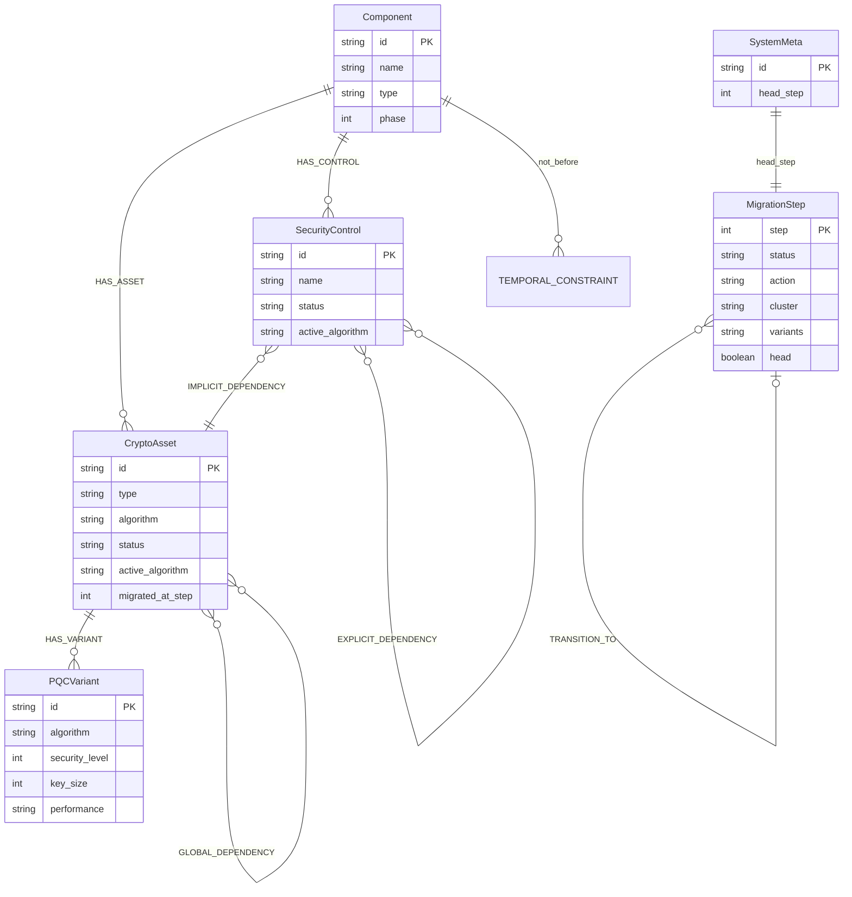
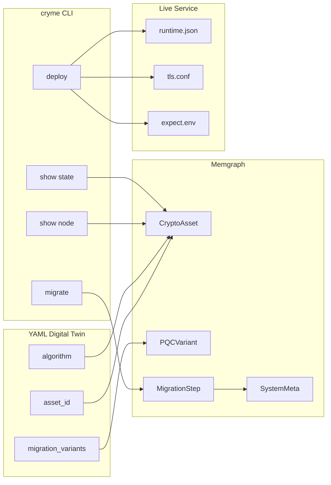

# CRYME — Domänenmodell und Begriffsverbindungen

> **See [GUIDE.md](GUIDE.md) § Domain Model** for the summary. This file is the deep dive.

---

## 1. Entity-Relation-Diagramm



---

## 2. Beziehungstypen

| Relation | Von → Nach | Bedeutung |
|----------|------------|-----------|
| `HAS_ASSET` | Component → CryptoAsset | Komponente besitzt kryptografisches Asset |
| `HAS_CONTROL` | Component → SecurityControl | Komponente hat Sicherheitskontrolle |
| `HAS_VARIANT` | CryptoAsset → PQCVariant | Migrationsziel-Katalog für ein Asset |
| `IMPLICIT_DEPENDENCY` | Control/Asset → Asset | Intra-Komponenten-Abhängigkeit (YAML) |
| `EXPLICIT_DEPENDENCY` | Control → Control/Asset | Deklarierte funktionale Abhängigkeit |
| `GLOBAL_DEPENDENCY` | Asset ↔ Asset | Systemübergreifende Kommunikation (bidirektional) |
| `IMPLICIT_DEPENDENCY {discovered}` | Asset ↔ Asset | Zur Laufzeit entdeckte versteckte Kante |
| `TEMPORAL_CONSTRAINT` | Component → Component | Phasen-Reihenfolge (`not_before`) |
| `TRANSITION_TO` | MigrationStep → MigrationStep | Historienbaum (kein Abhängigkeitsgraph!) |

Der **Abhängigkeitsgraph** (`show state`, `show graph`) enthält nur Asset/Control-Kanten. Der **Migrationsbaum** (`show tree`) enthält nur `TRANSITION_TO`.

---

## 3. Sprechende Namen — Regeln

### CryptoAsset: `asset_id` benennt die Rolle, nicht den Algorithmus

| Feld | Zweck | Beispiel | Falsch |
|------|-------|----------|--------|
| `asset_id` | Kryptografische **Funktion** im System | `KeyExchange_ECDHE`, `Cert_RSA2048` | `MLKEM768`, `Dilithium2` |
| `algorithm` (YAML) | **Ausgangs**-Algorithmus (Baseline) | `ECDHE`, `RSA-2048` | — |
| `active_algorithm` (Graph) | **Aktuell deployter** Algorithmus | `X25519_MLKEM768` | — |
| `status` | Migrationslebenszyklus | `classic` \| `migrated` | — |
| `PQCVariant.algorithm` | Ziel aus dem Katalog | `ML-DSA-44`, `X25519_MLKEM768` | — |

**Antwort auf „Richtiger Name für das Asset?":**  
Der Asset-Name (`asset_id`) beschreibt **was** das Asset tut (`KeyExchange_ECDHE` = Schlüsselaustausch für TLS). Der Algorithmus steht in separaten Feldern — nicht im Asset-Namen.

### SecurityControl: Protokoll oder Funktion

| Beispiel | Typ |
|----------|-----|
| `TLS 1.2 / 1.3 Communication` | Protokollsteuerung |
| `Secure Boot` | Integritätsprüfung (Automotive-Szenario) |
| `Remote Communication` | TLS-Kanal (Automotive) |

SecurityControls haben keinen `PQCVariant`-Katalog; sie nehmen freie Werte wie `TLS1.3` oder `TLS1.2/1.3`.

### Component: Physische oder logische Einheit

| Beispiel | phase | Bedeutung |
|----------|-------|-----------|
| `Webserver_Classic` | 1 | Baseline-Server (Phase 1) |
| `Client_Browser` | — | TLS-Client (simuliert via curl-container) |
| `Webserver_PQC` | 2 | Next-gen Server (`not_before: Webserver_Classic`) |

---

## 4. Brauche ich `status: migrated` in `cryme show node`?

**Ja.** `status` und `active_algorithm` sind bewusst getrennt:

| Feld | Semantik |
|------|----------|
| `status: classic` | Asset noch nicht migriert; `active_algorithm` leer → Baseline gilt |
| `status: migrated` | Oracle hat Migration genehmigt; `active_algorithm` gesetzt |
| `active_algorithm` | Welcher Algorithmus *aktiv* ist (Planungsebene) |

Ohne `status` wäre nicht unterscheidbar, ob ein Knoten noch auf Baseline läuft oder bereits migriert wurde. Nach `cryme deploy` stimmt der Laufzeit-API-Zustand mit dem Planungszustand überein.

`cryme show node` zeigt deshalb drei relevante Spalten: **Status**, **Baseline**, **Active**.

---

## 5. Begriffsverbindungen: YAML → Memgraph → CLI → API



| YAML-Feld | Memgraph-Property | CLI-Anzeige | Live-API (`/api/status`) |
|-----------|-------------------|-------------|--------------------------|
| `asset_id` | `CryptoAsset.id` (mit Prefix) | Asset / Control Name | Schlüssel in `algorithms` |
| `algorithm` | `CryptoAsset.algorithm` | Baseline | Wert wenn `migration_step=0` |
| `migration_variants[].algorithm` | `PQCVariant.algorithm` | (via migrate) | Wert nach Migration |
| — | `CryptoAsset.status` | Status | implizit über Algorithmen |
| — | `CryptoAsset.active_algorithm` | Active | Wert in `algorithms` nach Deploy |
| `control_name` | `SecurityControl.name` | Asset / Control Name | `algorithms` Eintrag |
| — | `MigrationStep.step` | show tree / state | `migration_step` |
| — | `SystemMeta.head_step` | (HEAD) | — |

---

## 6. Knoten-ID-Schema

Alle Knoten-IDs folgen dem Muster:

```
{component_id}.{asset_id_or_control_name}
```

Beispiele:

| ID | Typ |
|----|-----|
| `Webserver_Classic.KeyExchange_ECDHE` | CryptoAsset |
| `Webserver_Classic.Cert_RSA2048` | CryptoAsset |
| `Webserver_Classic.TLS_1.2_/_1.3_Communication` | SecurityControl |
| `Client_Browser.KeyExchange_ECDHE` | CryptoAsset |

Leerzeichen in Control-Namen werden zu Unterstrichen: `TLS 1.2 / 1.3 Communication` → `TLS_1.2_/_1.3_Communication`.

---

## 7. Zusammenhang der Hauptbegriffe

```
Digital Twin (YAML)
    └── Component
            ├── CryptoAsset (Baseline-Algorithmus + Varianten-Katalog)
            │       └── PQCVariant (Zielalgorithmen)
            ├── SecurityControl (Protokoll/Funktion)
            └── Dependencies (explicit, implicit, global)

Memgraph (Laufzeit)
    └── CryptoAsset / SecurityControl (status + active_algorithm)
    └── MigrationStep (Ereignisse, Deltas)
    └── SystemMeta (HEAD)

Orchestrator (cryme)
    ├── migrate  → Oracle prüft → MigrationStep + Playbook
    ├── deploy   → Ansible → Live-Zustand
    └── show state → Replay → Systemzustand bei Schritt N

Verifikation (extern)
    └── curl / openssl → TLS auf dem Draht
```

---

## 8. Verwandte Dokumentation

| Dokument | Inhalt |
|----------|--------|
| [DOMAIN_ANALYSIS.md](DOMAIN_ANALYSIS.md) | Akteure, Anwendungsfälle |
| [MIGRATION_STATES.md](MIGRATION_STATES.md) | Zustandsdiagramme pro Schritt |
| [TLS_ALGORITHMS.md](TLS_ALGORITHMS.md) | Algorithmus- und TLS-Matrix |
| [GRAPH_VERSIONING.md](GRAPH_VERSIONING.md) | MigrationStep-Schema, Replay |
