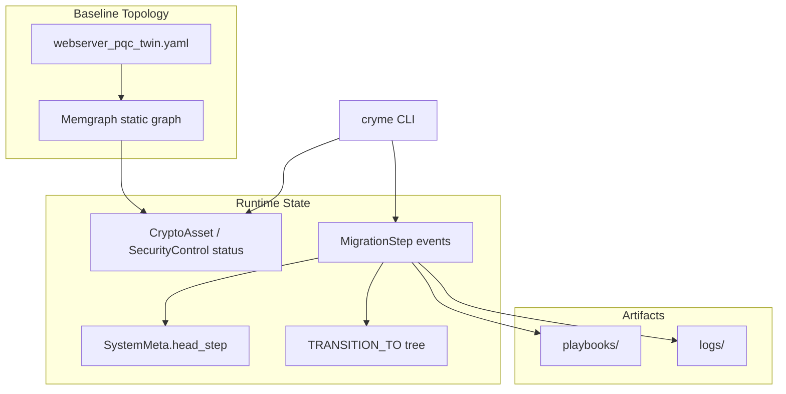

# CRYME Graph Versioning & Migration History

> **See [GUIDE.md](GUIDE.md) § Graph Versioning** for the summary.

---

## 1. Architecture Overview



CRYME uses **event sourcing**: the live Memgraph database holds the current node status, while `MigrationStep` nodes record every migration attempt as an immutable event. Graph state at step N is **reconstructed by replay**, not stored as a full snapshot.

---

## 2. Graph Node Types

| Label | ID example | Migration-relevant properties |
|-------|------------|--------------------------------|
| `Component` | `Webserver_Classic` | `phase`, temporal `not_before` |
| `CryptoAsset` | `Webserver_Classic.KeyExchange_ECDHE` | `status`, `active_algorithm`, `migrated_at_step` |
| `SecurityControl` | `Webserver_Classic.TLS_1.2_/_1.3_Communication` | `status`, `active_algorithm` |
| `PQCVariant` | `…KeyExchange_ECDHE_mlkem768` | target algorithm metadata |
| `MigrationStep` | step number | event log entry |
| `SystemMeta` | `cryme` | `head_step` pointer |

---

## 3. Edge Types in the Dependency Graph

| Relationship | Meaning |
|--------------|---------|
| `EXPLICIT_DEPENDENCY` | Declared functional dependency (YAML) |
| `IMPLICIT_DEPENDENCY` | Intra-component implicit dependency |
| `GLOBAL_DEPENDENCY` | Cross-component communication (bidirectional) |
| `IMPLICIT_DEPENDENCY {discovered: true}` | Learned at runtime when oracle blocks isolated migration |
| `TRANSITION_TO` | Links migration steps (history tree, not dependency graph) |
| `TEMPORAL_CONSTRAINT` | Component phase ordering |

The **dependency graph** (`show graph`) includes EXPLICIT, IMPLICIT, and GLOBAL edges. The **migration tree** (`show tree`) uses only `TRANSITION_TO`.

---

## 4. MigrationStep Event Schema

Each step stores:

| Property | Description |
|----------|-------------|
| `step` | Monotonic step number |
| `status` | `init`, `success`, `failed`, `aborted` |
| `action` | e.g. `migrate_success`, `migrate_fail`, `redundant_migration` |
| `cluster` | Node IDs migrated (or attempted) in this step |
| `variants` | JSON map of node → chosen PQC variant |
| `node_changes` | JSON delta: `{ id, before: {status, algo}, after: {status, algo} }` |
| `edge_changes` | JSON delta: discovered or added edges |
| `parent_step` | Previous successful step (git-like parent) |
| `head` | `true` only for the current HEAD step |
| `discovered_edge` | e.g. `A->B` when structural failure reveals hidden link |
| `playbook_file` | Path to generated Ansible playbook |
| `log_file` | Path to step log |

---

## 5. HEAD Pointer

Like Git's HEAD, CRYME marks the **current successful migration state**:

- `SystemMeta { id: 'cryme', head_step: N }` in Memgraph
- `MigrationStep.head = true` on step N
- `cryme show tree` prints `(HEAD)` next to that step
- `cryme show graph` without `step=` shows the graph at HEAD

On each successful migration, the previous HEAD flag is cleared and `head_step` is updated.

---

## 6. State Reconstruction (Event Replay)

`reconstructStateAtStep(session, N, { before: false })` in `web_app/oracle.js`:

1. **Baseline** — all nodes `classic`, static edges from YAML (no discovered edges).
2. **Replay steps 1..N** in order:
   - Failed steps with `discovered_edge` → add bidirectional implicit edges to `E_known`
   - Successful steps → set nodes to `migrated` with `active_algorithm` from `variants`
3. **Transitive reduction** on the resulting edge set.

For `--before`, replay only steps `1..(N-1)`.

This avoids storing full graph snapshots while allowing accurate `show graph`, `show diff`, and `show step`.

---

## 7. CLI Introspection (Git Analogies)

| CRYME command | Git analogue | What it shows |
|---------------|--------------|---------------|
| `show tree` | `git log --graph` | Migration step tree with branches |
| `show graph step=N` | checkout view at commit | Dependency graph at step N |
| `show step step=N` | `git show` | Step metadata + diff |
| `show diff step=N` | `git diff` | Node and edge changes only |
| HEAD marker | `HEAD` ref | Current live migration state |

---

## 8. Example: Step 1 → Step 2 (Webserver Scenario)

### Before Step 1 (baseline)

All assets `classic`. Server and browser key exchange connected via hidden global dependency (not yet in `E_known`).

### Step 1 (failed)

- Attempt: migrate `Webserver_Classic.KeyExchange_ECDHE` alone
- Oracle: structural failure (browser still classic)
- Event: `discovered_edge` fuses server ↔ browser into SCC

### Step 2 (success, HEAD)

- Co-migrate `Webserver_Classic.KeyExchange_ECDHE` + `Client_Browser.KeyExchange_ECDHE`
- `node_changes`: both nodes classic → migrated
- Playbook: `migrate_KeyExchange_ECDHE_to_X25519MLKEM768_step2.yml`

Inspect with:
```bash
cryme show diff step=2
cryme show graph step=2
cryme show tree    # Step 2 marked (HEAD)
```

---

## 9. Best Practices

| Practice | CRYME implementation |
|----------|---------------------|
| Immutable events | Never overwrite `MigrationStep`; append new steps |
| Derive state | Replay events; store compact deltas in `node_changes` / `edge_changes` |
| Branching history | Failed/aborted steps as leaves on `TRANSITION_TO` tree |
| HEAD pointer | `SystemMeta.head_step` + `MigrationStep.head` |
| Audit trail | Commit `playbooks/` and `logs/` to Git; Memgraph is runtime |
| Inspect before deploy | `show step` + `show diff` before `ansible-playbook` |

---

## 10. Web API

The web UI uses the same model:

- `GET /api/graph?step=N&before=true` — replayed graph for visualization
- `GET /api/ansible/:step` — download playbook (uses `playbook_file` name when available)

See [CLI_GUIDE.md](CLI_GUIDE.md) for Ansible execution instructions.
