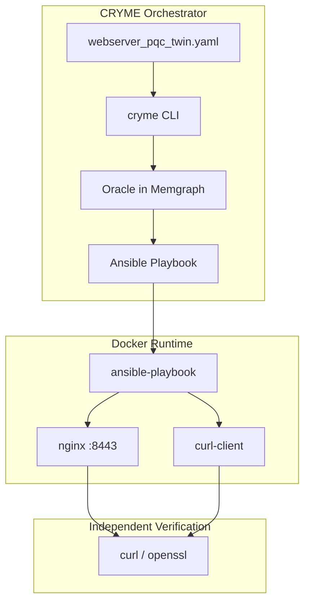
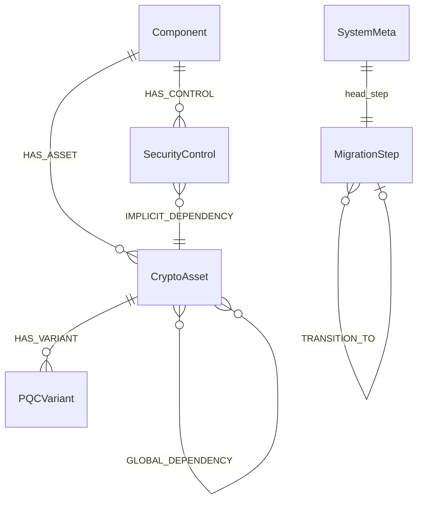

# CRYME — Comprehensive Guide

**Cryptographic Migration Engineering** · Post-Quantum Migration Oracle · Masterprojekt 2026

This is the single entry point for understanding, installing, operating, and demonstrating CRYME. Specialized deep-dive docs are linked at the end.

---

## Table of Contents

1. [What is CRYME?](#1-what-is-cryme)
2. [Architecture](#2-architecture)
3. [Installation & Setup](#3-installation--setup)
4. [Domain Model](#4-domain-model)
5. [Who Sees What (Domain Analysis)](#5-who-sees-what-domain-analysis)
6. [States vs. Steps](#6-states-vs-steps)
7. [CLI Reference](#7-cli-reference)
8. [End-to-End Demo](#8-end-to-end-demo)
9. [TLS Profiles & Algorithms](#9-tls-profiles--algorithms)
10. [Graph Versioning](#10-graph-versioning)
11. [Live Service](#11-live-service)
12. [Troubleshooting](#12-troubleshooting)
13. [Project Layout](#13-project-layout)
14. [Limitations & Roadmap](#14-limitations--roadmap)
15. [Further Reading](#15-further-reading)

---

## 1. What is CRYME?

CRYME is an **orchestrator** for planned post-quantum cryptography (PQC) migrations. It does not replace your TLS stack — it:

1. Models your system as a **digital twin** (YAML → graph database)
2. Validates each migration via an **Oracle** (dependency rules, SCC clustering)
3. Generates **Ansible playbooks** for approved transitions
4. Deploys cumulative TLS state to a **live HTTPS service**
5. Lets you **verify independently** with `curl` and `openssl`

```
YAML twin → cryme migrate → Oracle (Memgraph) → cryme deploy → Ansible → nginx :8443
                                              ↘ verify: curl / openssl
```

**Server:** `ilmare.local.cs.hs-rm.de` · **Project path:** `~/cryme` · **Live API:** `https://127.0.0.1:8443`

---

## 2. Architecture



| Component | Role |
|-----------|------|
| `cryme` CLI | Orchestrator — plan, validate, deploy, inspect |
| Memgraph | Graph DB — digital twin + migration history |
| `web_app/oracle.js` | Oracle engine — SCC, implicit edges, temporal rules |
| Ansible `cryme_tls` | Deploy engine — nginx TLS, certs, API state |
| nginx `:8443` | Live migratable HTTPS service |
| `cryme-curl-client` | Simulates `Client_Browser` TLS client |

---

## 3. Installation & Setup

### First-time server install

```bash
cd ~/cryme
sudo bash deploy/install_prerequisites.sh
source ~/.bashrc          # activates `cryme` alias
cryme init
cryme verify tls baseline
```

The installer configures:
- Docker + Memgraph + nginx + curl-client stack
- Node.js, Ansible, Git
- University proxy (`http://proxy.cs.hs-rm.de:8080`)
- Shell alias via `deploy/setup_shell.sh`

### Manual shell setup

```bash
bash deploy/setup_shell.sh
source ~/.bashrc
```

### Start / restart stack

```bash
cd ~/cryme
sudo docker-compose -f deploy/docker-compose.yml up -d
sudo docker ps --filter name=cryme
```

Expect 4 containers: `cryme-nginx-classic`, `cryme-memgraph`, `cryme-memgraph-lab`, `cryme-curl-client`.

### Memgraph Lab (GUI, from laptop)

```bash
ssh -L 3000:127.0.0.1:3000 -L 7687:127.0.0.1:7687 admin@ilmare
```

Open **http://localhost:3000** → connect `bolt://localhost:7687` (no credentials).

---

## 4. Domain Model

### Entity relationships



### Naming rules (sprechende Namen)

| Field | Purpose | Example |
|-------|---------|---------|
| `asset_id` | Cryptographic **role**, not algorithm | `KeyExchange_ECDHE`, `Cert_RSA2048` |
| `algorithm` (YAML) | **Baseline** algorithm | `ECDHE`, `RSA-2048` |
| `active_algorithm` (graph) | **Currently deployed** algorithm | `X25519_MLKEM768` |
| `status` | Migration lifecycle | `classic` \| `migrated` |
| `PQCVariant.algorithm` | Target from catalog | `ML-DSA-44` |

**Asset name ≠ algorithm.** The asset describes *what it does*; algorithms live in Baseline/Active fields.

### Node ID schema

```
{component_id}.{asset_id_or_control_name}
```

Examples:
- `Webserver_Classic.KeyExchange_ECDHE` (CryptoAsset)
- `Webserver_Classic.TLS_1.2_/_1.3_Communication` (SecurityControl)
- `Client_Browser.KeyExchange_ECDHE` (CryptoAsset)

### Webserver scenario nodes

| Node | Type | Baseline | Target variants |
|------|------|----------|-----------------|
| `Webserver_Classic.KeyExchange_ECDHE` | CryptoAsset | ECDHE | X25519_MLKEM768 |
| `Webserver_Classic.Cert_RSA2048` | CryptoAsset | RSA-2048 | ML-DSA-44, ML-DSA-65 |
| `Webserver_Classic.TLS_1.2_/_1.3_Communication` | SecurityControl | TLS1.2/1.3 | TLS1.3 |
| `Client_Browser.KeyExchange_ECDHE` | CryptoAsset | ECDHE | X25519_MLKEM768 |

Digital twin: [`webserver_pqc_twin.yaml`](webserver_pqc_twin.yaml)

---

## 5. Who Sees What (Domain Analysis)

| Actor | Sees | Tool |
|-------|------|------|
| **Operator** | Node status, migration tree, system state | `cryme show node/tree/state` |
| **Oracle** (system) | SCC clusters, implicit edges, temporal constraints | Memgraph + `oracle.js` |
| **Deploy engine** | Cumulative TLS state per step | Ansible `cryme_tls` |
| **External verifier** | Live TLS on the wire | `curl`, `openssl` (independent of CRYME) |

### Two views of the same truth

```bash
cryme show state step=N              # planning state (Memgraph replay)
curl -sk https://127.0.0.1:8443/api/status   # runtime state (nginx/API)
```

After `cryme deploy step=N`, both agree.

---

## 6. States vs. Steps

| Concept | Meaning | Command |
|---------|---------|---------|
| **MigrationStep** | An event — attempt or successful transition | stored in Memgraph |
| **Migration tree** | History of all attempts (incl. failures, branches) | `cryme show tree` |
| **System state** | Snapshot of all nodes + algorithms + edges | `cryme show state step=N` |
| **HEAD** | Current successful state | `(HEAD)` marker |

**Git analogy:**

| Git | CRYME |
|-----|-------|
| Commit | Successful MigrationStep |
| `git log --graph` | `cryme show tree` |
| Working tree at commit | `cryme show state step=N` |
| HEAD | `SystemMeta.head_step` |

### Standard demo states (steps 0–4)

| Step | Event | Oracle | Key change |
|------|-------|--------|------------|
| 0 | `cryme init` | — | All nodes classic |
| 1 | Migrate server KEX alone | ✗ FAIL | Discovers server↔browser edge |
| 2 | Same migrate (co-migration) | ✓ SUCCESS | Both KEX → X25519_MLKEM768 |
| 3 | Migrate cert | ✓ SUCCESS | Cert → ML-DSA-44 |
| 4 | Migrate TLS control | ✓ SUCCESS | TLS 1.3 only, all migrated |

Detailed state diagrams: [docs/MIGRATION_STATES.md](docs/MIGRATION_STATES.md)

---

## 7. CLI Reference

All commands work as `cryme <command>` after `source ~/.bashrc`.

### Inspect

| Command | Purpose |
|---------|---------|
| `cryme show node [id=…]` | All nodes: Status, Baseline, Active |
| `cryme show state [step=N] [--before]` | **System state** at step N or HEAD |
| `cryme show tree` | Migration event history (with HEAD) |
| `cryme show graph [step=N] [--before]` | Dependency graph (lower-level) |
| `cryme show step step=N` | Full step details (like `git show`) |
| `cryme show diff step=N` | What changed in step N (like `git diff`) |

### Operate

| Command | Purpose |
|---------|---------|
| `cryme init` | Reset Memgraph + live service to baseline |
| `cryme migrate id=NODE ALGO` | Migrate one or more nodes (shared algo) |
| `cryme migrate id=N1:ALGO1 id=N2:ALGO2` | Per-node algorithms |
| `cryme deploy step=N` | Deploy cumulative TLS state via Ansible |
| `cryme verify tls [step=N\|baseline]` | openssl + curl handshake proof |
| `cryme verify service [step=N\|baseline]` | Live API + TLS check |

### `show node` columns

| Column | Meaning |
|--------|---------|
| **Status** | `classic` or `migrated` (lifecycle — keep this!) |
| **Baseline** | Original algorithm from YAML |
| **Active** | Currently deployed algorithm (`-` if not migrated) |

### Migrate syntax examples

```bash
# Single node
cryme migrate id=Webserver_Classic.KeyExchange_ECDHE X25519_MLKEM768

# Multiple nodes, one algorithm
cryme migrate id=Webserver_Classic.KeyExchange_ECDHE,Client_Browser.KeyExchange_ECDHE X25519_MLKEM768

# Per-node algorithms
cryme migrate \
  id=Webserver_Classic.Cert_RSA2048:ML-DSA-44 \
  id=Webserver_Classic.KeyExchange_ECDHE:X25519_MLKEM768

# Security control (free values)
cryme migrate id=Webserver_Classic.TLS_1.2_/_1.3_Communication TLS1.3
```

Target algorithms must be declared as `migration_variants` in the YAML (except SecurityControls).

---

## 8. End-to-End Demo

### Quick 5-minute demo (professor meeting)

Use [docs/LIVE_DEMO_CHEAT_SHEET.md](docs/LIVE_DEMO_CHEAT_SHEET.md) — print and follow step by step.

### Full scripted demo

```bash
cd ~/cryme
sudo docker-compose -f deploy/docker-compose.yml up -d

# 0. Baseline
cryme init
curl -sk https://127.0.0.1:8443/api/status | python3 -m json.tool

# 1. Hidden dependency trap (FAIL)
cryme migrate id=Webserver_Classic.KeyExchange_ECDHE X25519_MLKEM768
cryme show tree

# 2. Co-migration (SUCCESS) + deploy
cryme migrate id=Webserver_Classic.KeyExchange_ECDHE X25519_MLKEM768
cryme deploy step=2
curl -sk https://127.0.0.1:8443/api/status | python3 -m json.tool

# 3. Certificate migration
cryme migrate id=Webserver_Classic.Cert_RSA2048 ML-DSA-44
cryme deploy step=3
echo | openssl s_client -connect 127.0.0.1:8443 2>/dev/null | openssl x509 -noout -subject

# 4. TLS 1.3 only
cryme migrate id=Webserver_Classic.TLS_1.2_/_1.3_Communication TLS1.3
cryme deploy step=4
cryme show state step=4
cryme verify tls step=4
```

Automated: `bash deploy/run_demo.sh`

### What to say at each phase

| Phase | Key message |
|-------|-------------|
| Baseline | "Live HTTPS on 8443 — standard curl/openssl, not CRYME output" |
| Step 1 fail | "Oracle detected hidden dependency between server and browser" |
| Step 2 success | "Same command, but Oracle now co-migrates the SCC cluster" |
| Deploy | "Same URL, different response — the live service changed" |
| Cert step | "Real certificate swap — visible with openssl" |
| Two views | "Oracle graph and HTTPS API agree after deploy" |

### Thesis claims demonstrated

| Claim | Evidence |
|-------|----------|
| Oracle detects hidden dependencies | Step 1 fails (server KEX without client) |
| Oracle learns SCC co-migration | Step 2 succeeds (both endpoints) |
| Plan deploys to live service | API + TLS change after `cryme deploy` |

Full report: [docs/DEMO_REPORT_FOR.md](docs/DEMO_REPORT_FOR.md)

---

## 9. TLS Profiles & Algorithms

Ansible role `cryme_tls` derives nginx profiles from migrated node algorithms.

| Profile | Cert | KEX | TLS | curl flags |
|---------|------|-----|-----|------------|
| `classic-rsa-ecdhe` | RSA-2048 | ECDHE | 1.2+1.3 | `--tlsv1.2 --tls-max 1.3` |
| `hybrid-kex-classic-cert` | RSA-2048 | X25519_MLKEM768 | 1.2+1.3 | `--tlsv1.2 --tls-max 1.3` |
| `hybrid-kex-mldsa-cert` | ML-DSA | X25519_MLKEM768 | 1.2+1.3 | `--tlsv1.2 --tls-max 1.3` |
| `tls13-only` | any | any | 1.3 only | `--tlsv1.3 --tls-max 1.3` |

### Verify TLS independently

```bash
cryme verify tls baseline
cryme verify tls step=2

# Manual
curl -sk https://127.0.0.1:8443/api/status | python3 -m json.tool
echo | openssl s_client -connect 127.0.0.1:8443 2>&1 | grep -E 'Protocol|Cipher|subject='
curl -skI https://127.0.0.1:8443/health | grep -i x-cryme-tls-profile
```

### Arbitrary algorithm rules

1. **CryptoAssets:** target must match a `PQCVariant` in YAML (exact or family match)
2. **SecurityControls:** free values (`TLS1.3`, `TLS1.2/1.3`)
3. **SCC expansion:** migrating one node in a cluster migrates all connected nodes
4. Add new algorithms: extend YAML `migration_variants`, then `cryme init`

Full matrix: [docs/TLS_ALGORITHMS.md](docs/TLS_ALGORITHMS.md)

---

## 10. Graph Versioning

CRYME uses **event sourcing**:

- Live Memgraph holds current node status
- `MigrationStep` nodes record every attempt as immutable events
- State at step N is **reconstructed by replay** (not stored as snapshot)

### Node types in Memgraph

| Label | Key properties |
|-------|----------------|
| `Component` | `phase`, `not_before` |
| `CryptoAsset` | `status`, `algorithm`, `active_algorithm`, `migrated_at_step` |
| `SecurityControl` | `status`, `active_algorithm` |
| `PQCVariant` | `algorithm`, `security_level` |
| `MigrationStep` | `step`, `status`, `cluster`, `variants`, `head` |
| `SystemMeta` | `head_step` |

### Edge types

| Relation | In dependency graph? | In migration tree? |
|----------|---------------------|-------------------|
| `EXPLICIT_DEPENDENCY` | Yes | No |
| `IMPLICIT_DEPENDENCY` | Yes | No |
| `GLOBAL_DEPENDENCY` | Yes | No |
| `TRANSITION_TO` | No | Yes |

Details: [docs/GRAPH_VERSIONING.md](docs/GRAPH_VERSIONING.md) · Oracle behaviour: [docs/migration_explanation.md](docs/migration_explanation.md)

---

## 11. Live Service

nginx on port **8443** is the live migratable service.

| Endpoint | Content |
|----------|---------|
| `https://127.0.0.1:8443/api/status` | `runtime.json` — migration step, profile, algorithms |
| `https://127.0.0.1:8443/api/data` | `data.json` — sample payload |
| `https://127.0.0.1:8443/health` | Health check + `X-Cryme-Tls-Profile` header |

### What changes per deploy

| Deploy step | nginx | API |
|-------------|-------|-----|
| `deploy step=2` | Hybrid KEX ciphers | KEX algos → X25519_MLKEM768 |
| `deploy step=3` | ML-DSA cert (ECDSA stand-in) | Cert → ML-DSA-44 |
| `deploy step=4` | TLS 1.3 only | TLS control → TLS1.3 |

Mapping: [`deploy/host_mapping.yml`](deploy/host_mapping.yml)

Details: [docs/LIVE_SERVICE.md](docs/LIVE_SERVICE.md)

---

## 12. Troubleshooting

| Problem | Fix |
|---------|-----|
| `cryme: command not found` | `bash deploy/setup_shell.sh && source ~/.bashrc` |
| Connection refused on 8443 | `sudo docker-compose -f deploy/docker-compose.yml up -d` |
| Memgraph empty / connection error | `bash deploy/check_memgraph.sh` then `cryme init` |
| `cryme deploy` fails (docker) | `sudo -E cryme deploy step=N` |
| Wrong step number for deploy | `cryme show tree` — use actual SUCCESS step numbers |
| Containers down | `sudo docker-compose -f deploy/docker-compose.yml up -d` |

```bash
bash deploy/check_memgraph.sh
sudo docker ps --filter name=cryme
cryme show tree
```

---

## 13. Project Layout

```
cryme/                          CLI entry point (orchestrator)
web_app/
  oracle.js                     Oracle engine
  twin_loader.js                YAML → Memgraph loader
  server.js                     Optional web UI backend
deploy/
  docker-compose.yml            Memgraph + nginx + curl-client
  install_prerequisites.sh      Server installer
  setup_shell.sh                Shell alias setup
  roles/cryme_tls/              Ansible TLS deploy role
  state/runtime.json            Live API state (updated by deploy)
  verify_tls.sh                 TLS verification script
playbooks/                      Generated migration playbooks
logs/                           Oracle step logs
docs/                           Detailed documentation
assets/                         Thesis PDFs, figures, Typst sources
webserver_pqc_twin.yaml         Webserver digital twin (active scenario)
digital_twin.yaml               Automotive digital twin (paper scenario)
GUIDE.md                        Main entry-point guide
```

---

## 14. Limitations & Roadmap

| Area | Current (Phase B) | Future (Phase C) |
|------|-------------------|------------------|
| PQC on the wire | ML-KEM/ML-DSA names map to classical OpenSSL TLS | OQS nginx for real PQC handshakes |
| Scenarios | Webserver + Browser (live), Automotive (YAML only) | More digital twins |
| UI | CLI-first; optional web UI | Streamlit/dashboard |

**Honest limitation to state in demos:**

> "Migration logic and deploy are fully live. ML-DSA / ML-KEM names map to classical TLS on the wire today. Real PQC handshakes = Phase C (OQS nginx)."

---

## 15. Further Reading

| Document | When to use |
|----------|-------------|
| [docs/LIVE_DEMO_CHEAT_SHEET.md](docs/LIVE_DEMO_CHEAT_SHEET.md) | One-page printout for live demo |
| [docs/DOMAIN_ANALYSIS.md](docs/DOMAIN_ANALYSIS.md) | Deep dive: actors, use cases |
| [docs/DOMAIN_MODEL.md](docs/DOMAIN_MODEL.md) | Deep dive: ER diagram, naming |
| [docs/MIGRATION_STATES.md](docs/MIGRATION_STATES.md) | Deep dive: state diagrams per step |
| [docs/TLS_ALGORITHMS.md](docs/TLS_ALGORITHMS.md) | Deep dive: TLS matrix, curl flags |
| [docs/CLI_GUIDE.md](docs/CLI_GUIDE.md) | CLI reference only |
| [docs/GRAPH_VERSIONING.md](docs/GRAPH_VERSIONING.md) | Event sourcing, HEAD, replay |
| [docs/migration_explanation.md](docs/migration_explanation.md) | Oracle SCC behaviour |
| [docs/DEMO_REPORT_FOR.md](docs/DEMO_REPORT_FOR.md) | Professor demo report |
| [docs/SERVER_DEPLOYMENT.md](docs/SERVER_DEPLOYMENT.md) | University server architecture |
| [docs/LIVE_SERVICE.md](docs/LIVE_SERVICE.md) | Live HTTPS service details |

---

*CRYME — Post-Quantum Migration Oracle · hs-rm.de · 2026*
