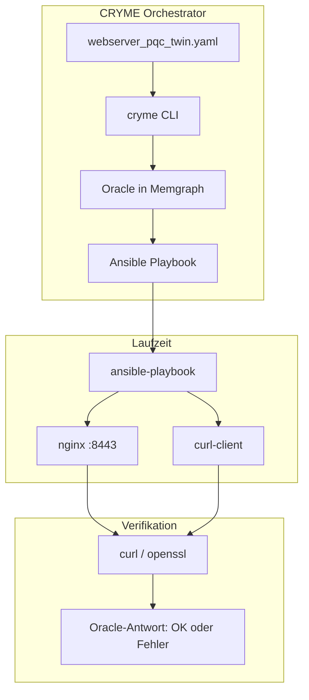

# CRYME — Anwendungsdomänenanalyse

> **See [GUIDE.md](../GUIDE.md) § Who Sees What** for the summary. This file is the deep dive.

---

## 1. Anwendungsdomäne

**CRYME** (Cryptographic Migration Engineering) ist ein Orchestrierungs-Framework für die **geplante Migration kryptografischer Assets** in komplexen Systemen — im aktuellen PoC: ein TLS-Webserver-Szenario mit Browser-Client.

Die Domäne umfasst:

- **Digitale Zwillinge** (YAML): Beschreibung von Komponenten, kryptografischen Assets, Sicherheitskontrollen und Abhängigkeiten
- **Migrationsplanung** (Oracle): Validierung, ob ein geplanter Zustandsübergang sicher ist
- **Deployment** (Ansible): Anwendung des genehmigten Zustands auf einen laufenden HTTPS-Dienst
- **Verifikation** (curl/openssl): Unabhängiger Nachweis auf dem Draht

CRYME ist der **Orchestrator** — er koordiniert Planung, Validierung und Deploy-Artefakte. Er ersetzt weder nginx noch curl; er steuert sie.

---

## 2. Akteure und Sichten

| Akteur | Rolle | Sieht / nutzt | Werkzeug |
|--------|-------|---------------|----------|
| **Operator/in** | Plant und führt Migrationen aus | Knotenstatus, Migrationsbaum, Systemzustand pro Schritt | `cryme show node`, `show tree`, `show state` |
| **Oracle** (System) | Entscheidet, ob ein Übergang erlaubt ist | SCC-Cluster, implizite Kanten, Temporal-Constraints | Memgraph + `web_app/oracle.js` |
| **Deploy-Engine** | Wendet kumulativen TLS-Zustand an | Zielalgorithmen, nginx-Profil, API-State | Ansible-Rolle `cryme_tls` |
| **Prüfer/in** (extern) | Verifiziert unabhängig vom Oracle | TLS-Handshake, Zertifikat, API-JSON | `curl`, `openssl` |

### Wer sieht was?

```
Operator/in          →  Planungsebene (Graph, Schritte, Zustände)
Oracle               →  Abhängigkeitsgraph + Regeln (intern)
Deploy-Engine        →  Kumulativer Zustand nach erfolgreichem Schritt
Prüfer/in (extern)   →  Laufzeit auf Port 8443 (unabhängig von CRYME)
```

Die **zwei Sichten derselben Wahrheit** (Demo-Kern):

```bash
cryme show state step=N    # Planungszustand (Memgraph, replay)
curl -sk https://127.0.0.1:8443/api/status   # Laufzeitzustand (nginx/API)
```

Nach `cryme deploy step=N` stimmen beide überein.

---

## 3. Domänenkonzept: Zustand vs. Schritt

| Begriff | Bedeutung in der Domäne | CLI / Daten |
|---------|-------------------------|-------------|
| **MigrationStep** | Ein Ereignis: Versuch oder erfolgreicher Übergang | `MigrationStep`-Knoten in Memgraph |
| **Migrationsbaum** | Verlauf aller Versuche (inkl. Fehlschläge, Verzweigungen) | `cryme show tree` |
| **Systemzustand** | Snapshot aller Assets + Algorithmen + Kanten zu einem Zeitpunkt | `cryme show state step=N` |
| **HEAD** | Aktueller erfolgreicher Zustand | `(HEAD)` in `show tree`, `show state` ohne step= |

**Wichtig:** Der Migrationsbaum sind **nicht** die Schritte selbst, sondern die **Historie von Zustandsübergängen**. Was Nutzerinnen und Nutzer als „aktueller Stand" sehen, ist der **Systemzustand** — alle Knoten mit `status` und `active_algorithm`.

Analogie zu Git:

| Git | CRYME |
|-----|-------|
| Commit | MigrationStep (success) |
| `git log --graph` | `cryme show tree` |
| Working tree at commit | `cryme show state step=N` |
| HEAD | `SystemMeta.head_step` |

---

## 4. Anwendungsfälle

### UC-1: System initialisieren

**Akteur:** Operator/in  
**Ziel:** Graph und Live-Dienst auf Baseline zurücksetzen

```bash
cryme init
```

**Ergebnis:** Alle Knoten `classic`, Schritt 0, Live-API `profile: classic-rsa-ecdhe`.

---

### UC-2: Migration planen und validieren

**Akteur:** Operator/in → Oracle  
**Ziel:** Prüfen, ob ein Asset (oder Cluster) auf einen Zielalgorithmus migriert werden darf

```bash
cryme migrate id=Webserver_Classic.KeyExchange_ECDHE X25519_MLKEM768
```

**Oracle-Antworten:**
- ✗ Struktureller Fehler (versteckte Abhängigkeit) → Kantenentdeckung
- ✗ Temporal-Policy verletzt → `aborted`
- ✓ Erfolg → Playbook generiert, HEAD aktualisiert

---

### UC-3: Systemzustand inspizieren

**Akteur:** Operator/in  
**Ziel:** Verstehen, wie das System *jetzt* aussieht (nicht nur die Historie)

```bash
cryme show node                    # alle Knoten: Status, Baseline, Active
cryme show state step=2            # Abhängigkeitsgraph + Algorithmen bei Schritt 2
cryme show diff step=2             # was sich in Schritt 2 geändert hat
```

---

### UC-4: Genehmigten Zustand deployen

**Akteur:** Operator/in → Deploy-Engine  
**Ziel:** Kumulativen TLS-Zustand auf nginx anwenden

```bash
cryme deploy step=2
```

**Ergebnis:** `deploy/nginx/live/tls.conf`, `deploy/state/runtime.json`, curl-client-Flags aktualisiert.

---

### UC-5: Unabhängig verifizieren

**Akteur:** Prüfer/in (extern)  
**Ziel:** Beweis auf dem Draht — ohne CRYME zu vertrauen

```bash
curl -sk https://127.0.0.1:8443/api/status | python3 -m json.tool
echo | openssl s_client -connect 127.0.0.1:8443 2>/dev/null | openssl x509 -noout -subject
cryme verify tls step=2
```

---

### UC-6: Auf beliebige Algorithmen migrieren

**Akteur:** Operator/in  
**Voraussetzung:** Zielalgorithmus ist als `PQCVariant` im Digital Twin deklariert

```bash
# Ein Algorithmus für mehrere Knoten
cryme migrate id=Webserver_Classic.KeyExchange_ECDHE,Client_Browser.KeyExchange_ECDHE X25519_MLKEM768

# Unterschiedliche Algorithmen pro Knoten
cryme migrate \
  id=Webserver_Classic.KeyExchange_ECDHE:X25519_MLKEM768 \
  id=Client_Browser.KeyExchange_ECDHE:X25519_MLKEM768
```

Siehe [TLS_ALGORITHMS.md](TLS_ALGORITHMS.md) für erlaubte Varianten.

---

## 5. Datenobjekte aus Nutzersicht

| Datenobjekt | Was die Nutzerin sieht | Beispiel |
|-------------|------------------------|----------|
| **Component** | Systemkomponente (Server, Browser) | `Webserver_Classic` |
| **CryptoAsset** | Kryptografisches Asset mit Rolle | `KeyExchange_ECDHE` |
| **SecurityControl** | Sicherheitsfunktion / Protokoll | `TLS 1.2 / 1.3 Communication` |
| **PQCVariant** | Wählbarer Zielalgorithmus | `X25519_MLKEM768` |
| **MigrationState** | Gesamtzustand bei Schritt N | alle Knoten + Kanten + Algorithmen |

---

## 6. Architektur (Orchestrierung)



**CRYME** generiert aus dem Graphen (Python/Node) Ansible-Playbooks und validiert jeden Übergang. Der eigentliche TLS-Handshake wird von nginx ausgeführt; curl/openssl liefern die externe Antwort des „Oracles auf dem Draht".

---

## 7. Verwandte Dokumentation

| Dokument | Inhalt |
|----------|--------|
| [DOMAIN_MODEL.md](DOMAIN_MODEL.md) | ER-Diagramm, Begriffe, Namensregeln |
| [MIGRATION_STATES.md](MIGRATION_STATES.md) | Systemzustand-Zeichnungen pro Schritt |
| [TLS_ALGORITHMS.md](TLS_ALGORITHMS.md) | Erlaubte TLS-Profile und curl-Flags |
| [GRAPH_VERSIONING.md](GRAPH_VERSIONING.md) | Event-Sourcing, HEAD, Replay |
| [CLI_GUIDE.md](CLI_GUIDE.md) | Befehlsreferenz |
