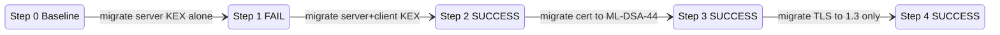
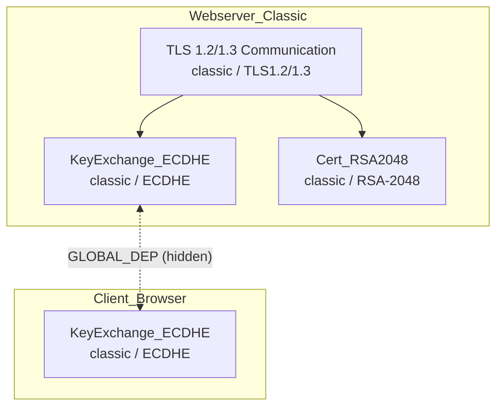
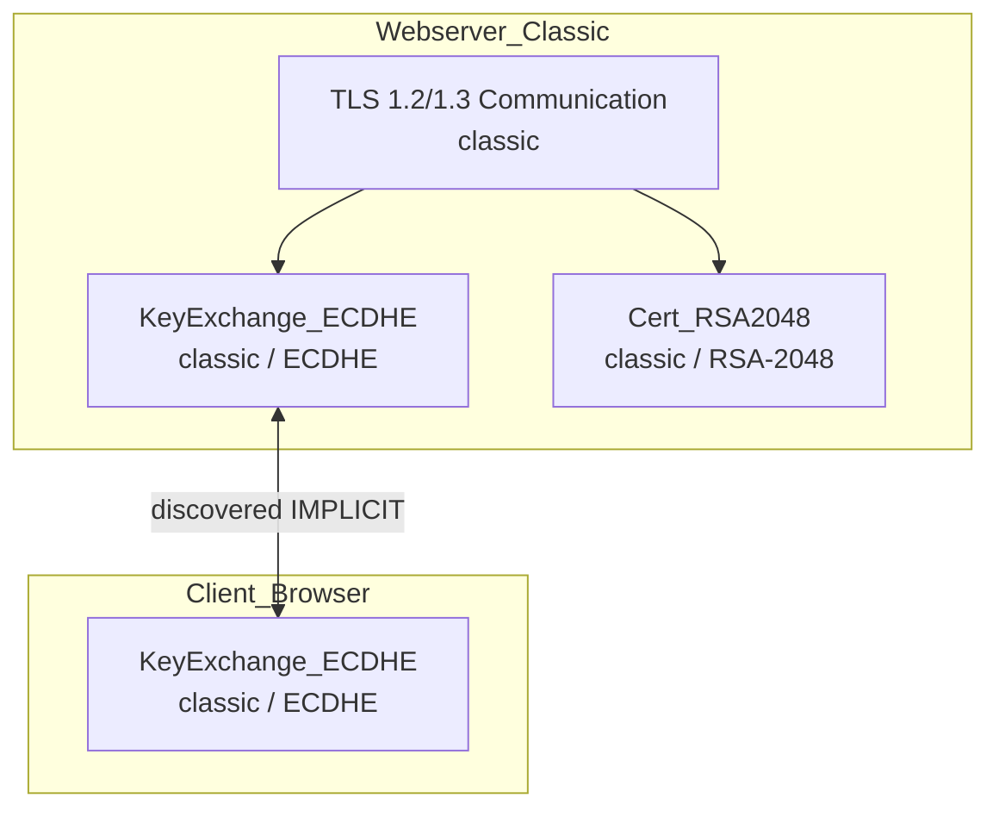
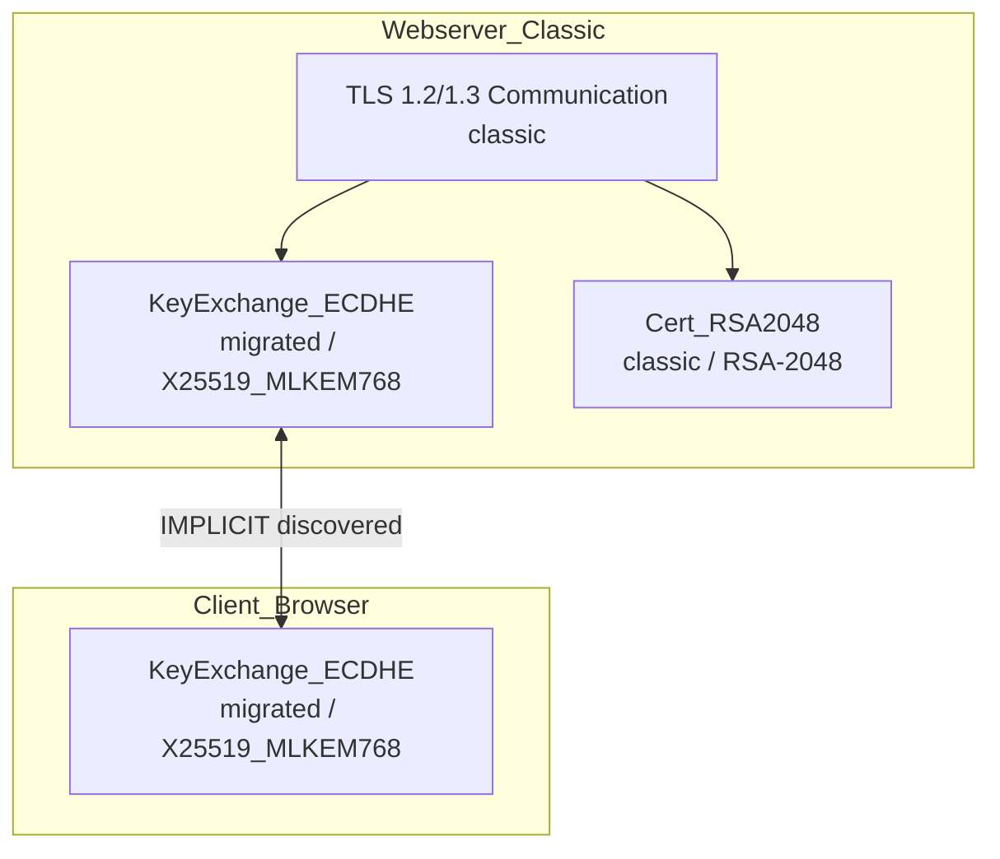
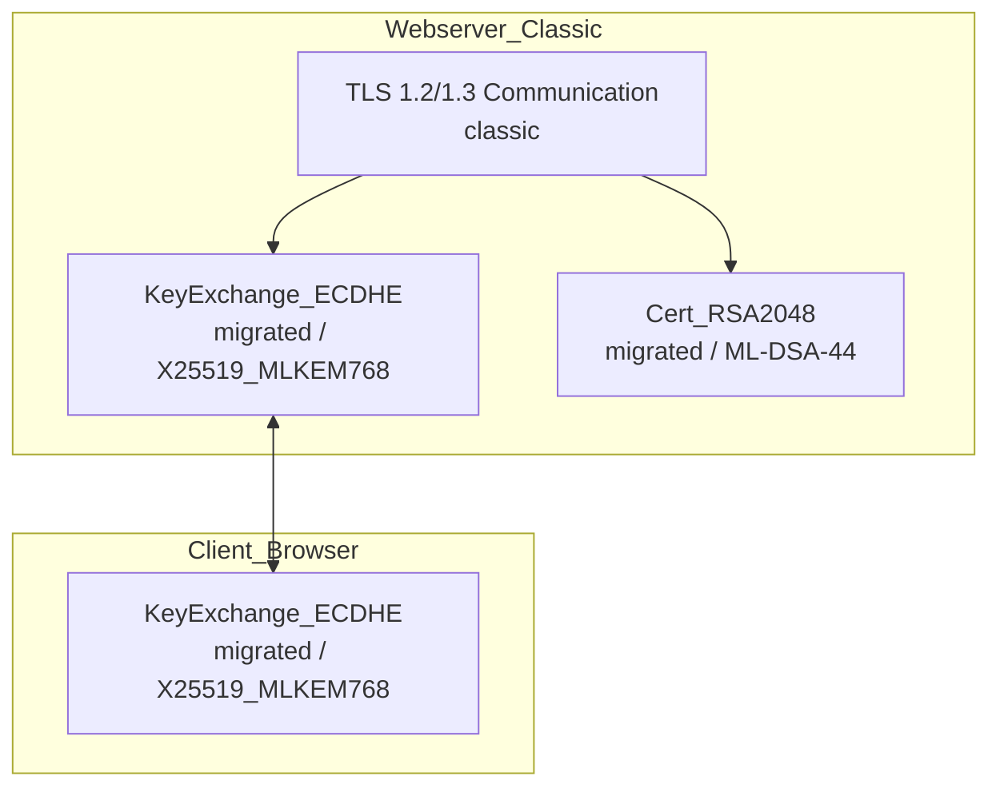
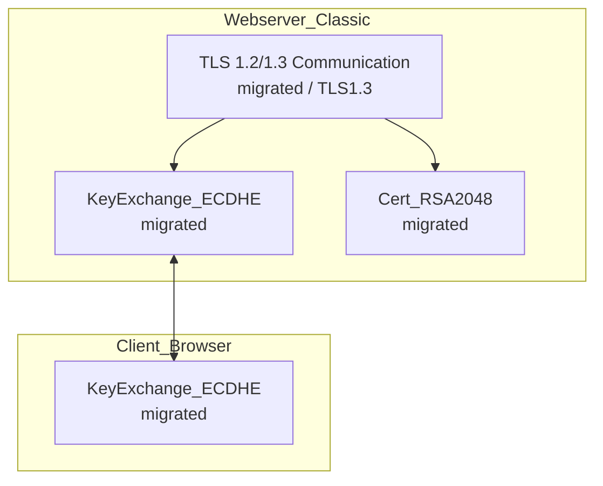

# CRYME — Systemzustände pro Migrationsschritt

> **See [GUIDE.md](../GUIDE.md) § States vs. Steps** for the summary. This file has full state diagrams.

Legende (wie in den Handskizzen):

- 🟡 **classic** — noch nicht migriert
- 🟢 **migrated** — erfolgreich migriert
- 🔴 **failed attempt** — Migration versucht, Oracle hat abgelehnt (Zustand unverändert)
- ✓ / ✗ — Oracle-Antwort

---

## Übersicht: Zustandsübergänge



---

## Step 0 — Baseline (Init)

**Befehl:** `cryme init`  
**HEAD:** Step 0 (init)  
**Live-API:** `migration_step: 0`, `profile: classic-rsa-ecdhe`

### Knotenzustand



| Knoten | Status | Baseline | Active |
|--------|--------|----------|--------|
| `Webserver_Classic.KeyExchange_ECDHE` | classic | ECDHE | — |
| `Webserver_Classic.Cert_RSA2048` | classic | RSA-2048 | — |
| `Webserver_Classic.TLS_1.2_/_1.3_Communication` | classic | TLS1.2/1.3 | — |
| `Client_Browser.KeyExchange_ECDHE` | classic | ECDHE | — |

### Verifikation

```bash
cryme show state step=0
curl -sk https://127.0.0.1:8443/api/status
echo | openssl s_client -connect 127.0.0.1:8443 2>/dev/null | openssl x509 -noout -subject
```

**Erwartung:** `CN=CRYME Classic RSA`, TLS 1.2/1.3, KEX ECDHE.

---

## Step 1 — Isolierte Server-KEX-Migration (FAILED)

**Befehl:**
```bash
cryme migrate id=Webserver_Classic.KeyExchange_ECDHE X25519_MLKEM768
```

**Oracle:** ✗ FAILED — versteckte Abhängigkeit entdeckt

### Knotenzustand (unverändert, aber Kante gelernt)



| Ereignis | Wirkung |
|----------|---------|
| Migration versucht | Server-KEX allein → PQC |
| Oracle blockiert | Browser noch classic → TLS bricht |
| Entdeckung | Bidirektionale Kante Server ↔ Browser in `E_known` |
| Zustand | **Unverändert** (rollback auf Step 0) |

**Migrationsbaum nach Step 1:**
```
Step 0 (INIT)
└── Step 1 (FAILED)
```

**Live-API:** unverändert (kein Deploy) — `migration_step: 0`

---

## Step 2 — Co-Migration Server + Client KEX (SUCCESS)

**Befehl:** gleicher migrate-Befehl (Oracle kennt jetzt die Kante)  
**Deploy:** `cryme deploy step=2`  
**Oracle:** ✓ SUCCESS

### Knotenzustand



| Knoten | Status | Baseline | Active |
|--------|--------|----------|--------|
| `Webserver_Classic.KeyExchange_ECDHE` | migrated | ECDHE | X25519_MLKEM768 |
| `Client_Browser.KeyExchange_ECDHE` | migrated | ECDHE | X25519_MLKEM768 |
| `Webserver_Classic.Cert_RSA2048` | classic | RSA-2048 | — |
| `Webserver_Classic.TLS_1.2_/_1.3_Communication` | classic | TLS1.2/1.3 | — |

### Live-API nach Deploy

```json
{
  "migration_step": 2,
  "profile": "hybrid-kex-classic-cert",
  "algorithms": {
    "Webserver_Classic.KeyExchange_ECDHE": "X25519_MLKEM768",
    "Client_Browser.KeyExchange_ECDHE": "X25519_MLKEM768",
    "Webserver_Classic.Cert_RSA2048": "RSA-2048",
    "Webserver_Classic.TLS_1.2_/_1.3_Communication": "TLS1.2/1.3"
  }
}
```

**Migrationsbaum:**
```
Step 0 (INIT)
└── Step 1 (FAILED)
    └── Step 2 (SUCCESS) (HEAD)
```

---

## Step 3 — Zertifikat-Migration (SUCCESS)

**Befehl:**
```bash
cryme migrate id=Webserver_Classic.Cert_RSA2048 ML-DSA-44
cryme deploy step=3
```

**Oracle:** ✓ SUCCESS

### Knotenzustand



| Knoten | Status | Active |
|--------|--------|--------|
| `Webserver_Classic.Cert_RSA2048` | migrated | ML-DSA-44 |
| (alle KEX-Knoten) | migrated | X25519_MLKEM768 |

### Verifikation auf dem Draht

```bash
echo | openssl s_client -connect 127.0.0.1:8443 2>/dev/null | openssl x509 -noout -subject
```

**Erwartung:** `subject=CN=CRYME ML-DSA Demo` (ECDSA-Stand-in für ML-DSA im PoC)

---

## Step 4 — TLS 1.3 only (SUCCESS, final)

**Befehl:**
```bash
cryme migrate id=Webserver_Classic.TLS_1.2_/_1.3_Communication TLS1.3
cryme deploy step=4
```

**Oracle:** ✓ SUCCESS — alle 4 Knoten migrated

### Knotenzustand (Endzustand)



| Feld | Wert |
|------|------|
| `profile` | `tls13-only` |
| `migration_step` | `4` |
| Alle Knoten | `migrated` |

### curl-Flags (Client_Browser)

Nach Step 4: `CRYME_CURL_TLSFLAGS=--tlsv1.3 --tls-max 1.3`

---

## Zwei Pfade im Migrationsbaum (Verzweigung)

Wie in den Handskizzen: Nach einem erfolgreichen Zustand kann ein **anderer Migrationsschritt** zu einem alternativen Endzustand führen (z. B. andere Zertifikatsvariante `ML-DSA-65` statt `ML-DSA-44`). Fehlgeschlagene Versuche erscheinen als Zweige:

```
Step 0
└── Step 1 (FAILED) — isolierte Server-KEX
    ├── Step 2 (SUCCESS) — Co-Migration  ← HEAD im Standard-Demo
    │   ├── Step 3 (SUCCESS) — Cert
    │   │   └── Step 4 (SUCCESS) — TLS1.3
    └── Step N (ABORTED) — Policy-Verletzung (z. B. Webserver_PQC zu früh)
```

`cryme show tree` zeigt diese Verzweigungen; `cryme show state step=N` zeigt den **Zustand** am jeweiligen Knoten des Erfolgspfads.

---

## CLI-Befehle pro Zustand

| Zustand | Befehl |
|---------|--------|
| Baseline | `cryme show state step=0` |
| Nach Fehlschlag | `cryme show state step=0` (Zustand gleich; `show tree` zeigt Step 1) |
| Nach Step 2 Deploy | `cryme show state step=2` + `curl -sk https://127.0.0.1:8443/api/status` |
| Diff eines Schritts | `cryme show diff step=N` |
| Vollständige Schritt-Info | `cryme show step step=N` |

---

## Verwandte Dokumentation

| Dokument | Inhalt |
|----------|--------|
| [DOMAIN_ANALYSIS.md](DOMAIN_ANALYSIS.md) | Zustand vs. Schritt, Akteure |
| [DOMAIN_MODEL.md](DOMAIN_MODEL.md) | ER-Diagramm, Knoten-IDs |
| [TLS_ALGORITHMS.md](TLS_ALGORITHMS.md) | Profile und curl-Flags pro Schritt |
| [LIVE_DEMO_CHEAT_SHEET.md](LIVE_DEMO_CHEAT_SHEET.md) | Demo-Skript |
