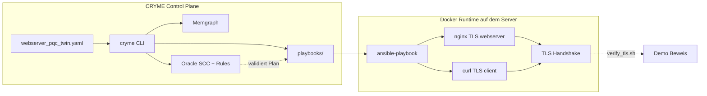
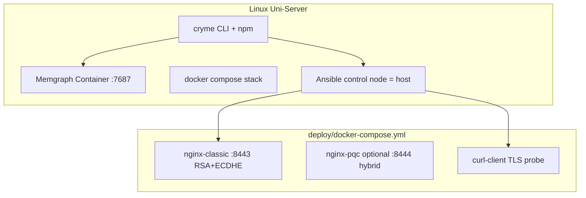
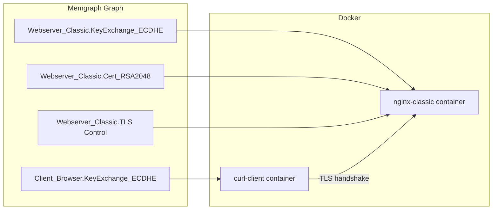

# CRYME University Server Deployment

> **See [GUIDE.md](../GUIDE.md)** for install and operations. This doc covers server architecture.

**Related:** [CLI_GUIDE.md](CLI_GUIDE.md) · [GRAPH_VERSIONING.md](GRAPH_VERSIONING.md) · [migration_demo_commands.md](migration_demo_commands.md)

**University proxy:** `http://proxy.cs.hs-rm.de:8080` — configured in `deploy/install_prerequisites.sh`.

---

## Implementation status

- [x] **Phase A:** Docker stack (Memgraph + nginx + curl-client)
- [x] **Phase B:** Ansible `cryme_tls` role, live TLS deploy, `cryme deploy` + `cryme verify`
- [ ] **Phase C (optional):** OQS nginx for real PQC handshakes on the wire

---

## Ziel

Auf dem Uni-Server soll die **komplette Kette** demonstrierbar sein:



**Installierbar auf dem Server:** Docker, Docker Compose, Node.js/npm, Ansible, Git.

---

## Current capabilities (Phase A + B complete)

| Capability | Status |
|------------|--------|
| Digital twin from YAML | Yes |
| Oracle (SCC, implicit edges, temporal) | Yes |
| Migration history (tree, state, diff, HEAD) | Yes |
| Live nginx HTTPS on :8443 | Yes |
| Ansible TLS deploy via `cryme deploy` | Yes |
| curl-client browser simulation | Yes |
| Independent TLS verification | Yes |
| Real PQC handshakes (ML-KEM, ML-DSA on wire) | No — Phase C |

---

## Architektur (University Server mit Docker)



| Komponente | Rolle | Installation |
|------------|-------|--------------|
| **Docker + Compose** | Runtime für TLS-Dummy | `apt install docker.io docker-compose-plugin` |
| **Memgraph** | Graph-DB | Docker: `memgraph/memgraph` |
| **Node.js 18+ / npm** | CRYME CLI | Paketmanager + `web_app/npm install` |
| **Ansible** | Playbook gegen Container/Host | `apt install ansible` |
| **nginx-classic** | Echter TLS-Webserver (RSA-2048 + ECDHE) | Docker image + mounted certs/config |
| **curl-client** | Simuliert `Client_Browser` TLS-Handshake | Docker, ruft nginx auf |

---

## Phasenplan

### Phase A — Infrastruktur (Demo-Grundlage)

Ziel: Server stack lauffähig, CRYME CLI wie lokal.

- `deploy/docker-compose.yml`:
  - Service `memgraph` (Port 7687 → localhost)
  - Service `nginx-classic`: HTTPS auf `:8443`, klassisches TLS (RSA + ECDHE)
  - Service `curl-client`: `curl -vk https://nginx-classic:443/health`
- `deploy/install_prerequisites.sh`: Docker, npm, ansible, git
- `deploy/verify_tls.sh`: vor/nach Migration Cipher/Protocol ausgeben (`openssl s_client` / `curl -v`)
- `cryme init` + volle Migrate-Demo wie `migration_demo_commands.md`

**Ergebnis Phase A:** TLS läuft klassisch; CRYME-Oracle läuft; Playbooks noch ohne Wirkung auf nginx.

### Phase B — Graph → echter TLS-Deploy (empfohlen für Thesis-Demo)

Ziel: Jeder erfolgreiche `cryme migrate`-Step **ändert nginx wirklich**.

Neue Ansible-Rolle `deploy/roles/cryme_tls/`:

| Graph-Knoten (YAML) | Ansible-Wirkung auf nginx |
|---------------------|---------------------------|
| `Webserver_Classic.KeyExchange_ECDHE` → `X25519_MLKEM768` | Update `ssl_ciphers` / KEX-Config; später hybrid via OQS |
| `Webserver_Classic.Cert_RSA2048` → `ML-DSA-44/65` | Deploy neues Server-Zertifikat (Demo: self-signed) |
| `Webserver_Classic.TLS_1.2_/_1.3_Communication` → `TLS1.3` | `ssl_protocols TLSv1.3;`, reload nginx |
| `Client_Browser.KeyExchange_ECDHE` | Update curl-client flags / cipher suite expectation |

Inventory `deploy/inventory/hosts.ini`:

```ini
[webserver]
nginx-classic ansible_host=127.0.0.1 ansible_port=2222

[clients]
curl-client ansible_connection=docker

[webserver:vars]
nginx_config_path=/etc/nginx/conf.d/tls.conf
tls_listen_port=8443
```

**Code-Änderung in CRYME:** `web_app/oracle.js` → `generatePlaybookContent()`:

```yaml
- name: Apply CRYME migration to TLS stack
  ansible.builtin.include_role:
    name: cryme_tls
  vars:
    migration_step: "{{ migration_step }}"
    target_algorithms: "{{ target_algorithms }}"
```

Hosts: `process.env.CRYME_ANSIBLE_HOSTS || "webserver"`.

**Ergebnis Phase B:** Nach Step 2 zeigt `verify_tls.sh` geänderte Cipher/Protocol; nach Step 6 nur TLS 1.3.

### Phase C — Echtes PQC-TLS (optional)

- Container `nginx-oqs` (Open Quantum Safe Provider)
- Hybrid-KEX `X25519_MLKEM768`
- ML-DSA-Zertifikate experimentell — Phase B reicht meist für Thesis-Demo

---

## Mapping: YAML Twin ↔ Docker-Welt

`webserver_pqc_twin.yaml` = logische Wahrheit (Oracle). Docker = physische Instanz.



Optional: `deploy_target: nginx-classic` pro Component in YAML, sonst `deploy/host_mapping.yml`.

---

## Demo-Ablauf (CLI + Ansible + TLS-Verify)

```bash
# Setup (einmalig) — setzt Proxy http://proxy.cs.hs-rm.de:8080 für apt/Docker/npm
sudo bash deploy/install_prerequisites.sh
cd web_app && npm install && cd ..
cryme init

# Baseline: klassisches TLS
cryme verify tls baseline
# oder: bash deploy/verify_tls.sh baseline

# CRYME Migration + Deploy pro Step
cryme migrate id=Webserver_Classic.KeyExchange_ECDHE X25519_MLKEM768  # fail
cryme migrate id=Webserver_Classic.KeyExchange_ECDHE X25519_MLKEM768  # success
cryme deploy step=2
cryme verify tls step=2

# Steps 4–6 Cert, TLS Control ...
cryme show tree
cryme show diff step=4
cryme deploy step=4
cryme verify tls step=4

# Vollständige Demo-Schleife
bash deploy/run_demo.sh
```

---

## Dateien die noch erstellt werden

| Datei | Aktion |
|-------|--------|
| `deploy/docker-compose.yml` | Memgraph + nginx-classic + curl-client |
| `deploy/nginx/` | TLS configs (classic + migrated templates) |
| `deploy/roles/cryme_tls/` | Node→nginx task mapping |
| `deploy/inventory/hosts.ini` | webserver + client groups |
| `deploy/verify_tls.sh` | TLS handshake proof |
| `deploy/run_demo.sh` | migrate → deploy → verify loop |
| `web_app/oracle.js` | `include_role: cryme_tls`, konfigurierbare hosts |
| `cryme` | `deploy step=N`, optional `verify tls` |

---

## Sicherheit (University Server)

- Memgraph + nginx nur auf localhost / internes Docker-Netz
- Ports nach außen: nur `:8443` HTTPS Demo (Firewall einschränken)
- Self-signed Certs für Demo
- CRYME Web-UI (3050) optional, nicht für Server-Demo nötig

---

## Implementierungsreihenfolge

1. **Phase A:** docker-compose + install script + verify_tls baseline + CRYME CLI demo
2. **Phase B:** cryme_tls Ansible role + oracle.js playbook extension + inventory
3. **cryme deploy step=N** + run_demo.sh Automatisierung
4. **Phase C (optional):** OQS nginx container für echtes hybrid PQC-TLS

---

## Kurzantwort

**Können wir mit dem aktuellen CRYME-Stand Security Controls / TLS zu PQC migrieren und am echten Webserver zeigen?**

- **Oracle & Migrationsplanung:** Ja — vollständig.
- **Ansible deployt heute echtes TLS:** Nein — nur Platzhalter-Config.
- **Mit Phase A:** TLS-Webserver läuft, CRYME plant — getrennte Beweise.
- **Mit Phase B (empfohlen):** Ja für Demo — nginx TLS ändert sich schrittweise gemäß CRYME-Steps.
- **Mit Phase C:** Echtes PQC am Wire — machbar mit OQS-Docker, zusätzlicher Aufwand.
