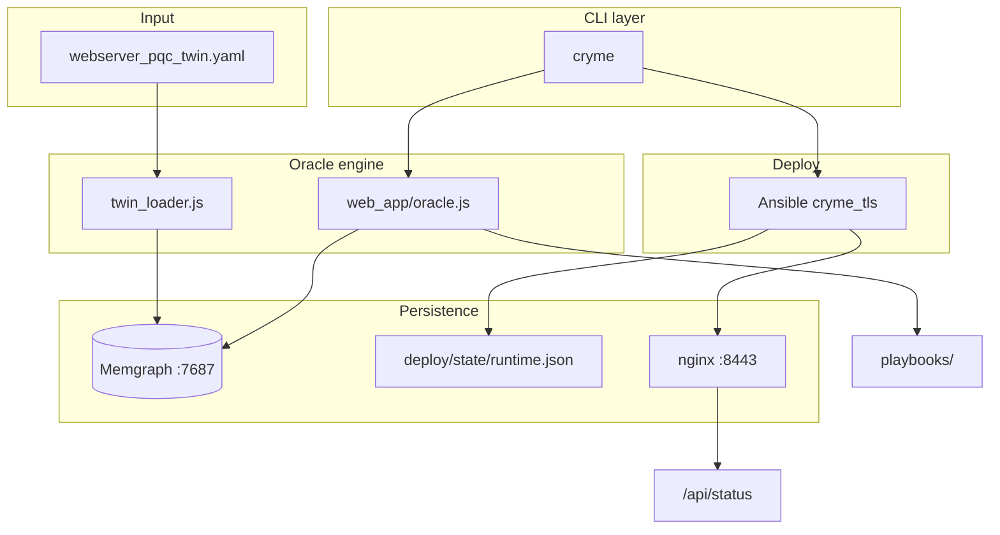

# CRYME — Technical Documentation

This document explains the **source code**, **architecture**, and **data flow** of CRYME. Audience: reviewers who want to understand the code without reading every file.

> User-facing overview: [GUIDE.md](../GUIDE.md) · Installation: [INSTALL.md](../INSTALL.md)  
> Memgraph usage and demo queries: [MEMGRAPH_GUIDE.md](MEMGRAPH_GUIDE.md)

---

## 1. What CRYME does technically

CRYME is an **orchestrator** for planned post-quantum cryptography (PQC) migrations. It does not replace a TLS implementation. It connects four layers:

```
webserver_pqc_twin.yaml          Digital twin (source of truth)
        ↓
web_app/oracle.js                Oracle engine (validation, SCC, history)
        ↓
cryme (CLI)                      Operator interface
        ↓
deploy/ (Docker + Ansible)       Live HTTPS service on port 8443
```

**Core idea:** every migration is validated in the graph (Memgraph) first. Only a successful plan produces an Ansible playbook, which `cryme deploy` can apply to the live service.

---

## 2. Project layout (code map)

| Path | Language | Role |
|------|----------|------|
| `cryme` | Node.js (CLI) | Entry point — parses arguments, calls `oracle.js` and shell scripts |
| `web_app/oracle.js` | JavaScript | **Core logic**: SCC, migrate, replay, playbook generation |
| `web_app/twin_loader.js` | JavaScript | YAML → Memgraph (`cryme init`) |
| `web_app/server.js` | JavaScript | Optional web UI (same Oracle + Memgraph) |
| `web_app/check_db.js` | JavaScript | Bolt connectivity smoke test |
| `webserver_pqc_twin.yaml` | YAML | Digital twin (webserver + browser) |
| `deploy/docker-compose.yml` | YAML | Memgraph, nginx, curl-client |
| `deploy/roles/cryme_tls/` | Ansible/Jinja2 | Derive TLS profile from migration state |
| `deploy/verify_tls.sh` | Bash | TLS handshake + `/api/status` check |
| `playbooks/` | Ansible YAML | Playbooks generated per migration step |
| `logs/` | Text | Oracle output per step |

---

## 3. Architecture diagram



---

## 4. Module: `cryme` (CLI)

**File:** `cryme` (executable Node.js script at the project root)

### Responsibilities

1. Parse command-line arguments (`show`, `migrate`, `deploy`, `verify`, `init`)
2. Open a Memgraph session and call functions from `oracle.js`
3. For `deploy` and `verify`: start external tools (`ansible-playbook`, `bash deploy/verify_tls.sh`)

### Commands → functions / tools

| CLI command | Oracle function / external tool |
|-------------|-------------------------------|
| `cryme init` | `initDatabase()` + `resetLiveServiceState()` |
| `cryme migrate …` | `migrateNodes()` |
| `cryme show state step=N` | `reconstructStateAtStep()` |
| `cryme show graph step=N` | `reconstructStateAtStep()` + `renderGraphAscii()` |
| `cryme show diff step=N` | `computeStepDiff()` |
| `cryme show step step=N` | `computeStepDiff()` + `renderStepShowAscii()` |
| `cryme show tree` | Cypher on `MigrationStep` + `TRANSITION_TO` |
| `cryme show node` | Cypher on `CryptoAsset` / `SecurityControl` |
| `cryme deploy step=N` | `getStepDeployInfo()` → Ansible |
| `cryme verify step=N` | `deploy/verify_tls.sh` |

### Connection to Memgraph

Defined in `web_app/oracle.js` and reused by the CLI:

```javascript
const URI = "bolt://localhost:7687";
const driver = neo4j.driver(URI, neo4j.auth.basic("", ""));
```

No username or password — Memgraph runs locally in Docker.

---

## 5. Module: `web_app/oracle.js` (Oracle engine)

This is the **technical core** (~1,300 lines). The CLI is a thin wrapper around the exports at the bottom of this file.

### 5.1 Graph algorithms (in-memory)

| Function | Algorithm | Purpose |
|----------|-----------|---------|
| `computeSCCs()` | Tarjan | Strongly connected components — which nodes must migrate together? |
| `computeTransitiveReduction()` | Floyd–Warshall | Drop redundant edges (transitive reduction) |

These run on the in-memory graph loaded from Memgraph, not as Cypher procedures.

### 5.2 State management

| Function | Description |
|----------|-------------|
| `loadStateFromDB()` | Reads the current graph from Memgraph (nodes, edges, history) |
| `loadBaselineTopology()` | Static topology from YAML (no runtime discoveries) |
| `reconstructStateAtStep(N)` | **Event replay**: reconstruct state at step N by applying events 1..N |
| `getHeadStep()` | Current HEAD pointer (last successful step) |
| `updateHeadStep(N)` | Clear previous HEAD, set `SystemMeta.head_step` and `MigrationStep.head` |

**Event sourcing:** state at step N is not stored as a snapshot. It is **computed** from baseline + `MigrationStep` events 1..N. Details: [GRAPH_VERSIONING.md](GRAPH_VERSIONING.md).

### 5.3 Migration flow (`migrateNodes`)

```
1. Resolve target nodes (name or Memgraph internal ID)
2. Build cluster (SCC over explicit + implicit + global edges)
3. For each node, resolve the target algorithm (PQCVariant from YAML)
4. Oracle validation (checkOracleValidation):
   - Already migrated? → redundant
   - Temporal constraints (not_before)?
   - Structural dependencies?
5. On failure: persist discovered_edge (Oracle learns a new implicit edge)
6. On success:
   - Set nodes in Memgraph to status=migrated
   - Create a MigrationStep event
   - Update HEAD
   - Generate an Ansible playbook
   - Write a log file
```

Failed steps still create a `MigrationStep` (status `failed` or `aborted`) so the history tree stays complete. HEAD does **not** move on failure.

### 5.4 Oracle validation (`checkOracleValidation`)

Checks include:

- **Co-migration:** nodes in the same SCC must migrate together
- **Implicit dependencies:** SecurityControls depend on CryptoAssets
- **Global dependencies:** server KEX ↔ browser KEX (demo step 1 fails here)
- **Temporal:** `not_before` constraints between components

### 5.5 Deploy preparation

| Function | Description |
|----------|-------------|
| `getStepDeployInfo(N)` | Reconstruct state at step N, write `deploy/vars/step_N.json` |
| `buildDeployVarsFromState()` | Map nodes → algorithms for Ansible |
| `generatePlaybookContent()` | Write a playbook that `include_role: cryme_tls` |
| `resetLiveServiceState()` | Copy baseline `runtime.json` / `data.json` and reload nginx (used by `cryme init`) |

`cryme deploy` **reads** Memgraph (via replay). It does **not** write new graph events.

---

## 6. Module: `web_app/twin_loader.js`

Called by `initDatabase()` during `cryme init`.

### Flow

1. `initDatabase()` empties Memgraph (`MATCH (n) DETACH DELETE n`)
2. `populateMemgraphWithTwin()` walks `webserver_pqc_twin.yaml`:
   - Create a `Component` node per component
   - Create `CryptoAsset` + `PQCVariant` nodes
   - Create `SecurityControl` nodes
3. Create edges: `HAS_ASSET`, `HAS_CONTROL`, `HAS_VARIANT`, `EXPLICIT_DEPENDENCY`, `IMPLICIT_DEPENDENCY`, `GLOBAL_DEPENDENCY`, `TEMPORAL_CONSTRAINT`

`SystemMeta` and the initial `MigrationStep` (step 0, `status: init`) are **not** created here. The first `cryme migrate` uses `MERGE (init:MigrationStep {step: 0})` and `updateHeadStep()` creates `SystemMeta`.

**Source file:** `webserver_pqc_twin.yaml`

---

## 7. Module: Ansible role `cryme_tls`

**Path:** `deploy/roles/cryme_tls/`

### Input (via `cryme deploy step=N`)

```json
{
  "migration_step": 2,
  "migrated_nodes": ["Webserver_Classic.KeyExchange_ECDHE", "Client_Browser.KeyExchange_ECDHE"],
  "target_algorithms": {
    "Webserver_Classic.KeyExchange_ECDHE": "X25519_MLKEM768",
    "Client_Browser.KeyExchange_ECDHE": "X25519_MLKEM768"
  }
}
```

### TLS profile derivation (`tasks/main.yml`)

From `target_algorithms`:

| Condition | TLS profile | nginx certificate | Protocols |
|-----------|-------------|-------------------|-----------|
| Everything classic | `classic-rsa-ecdhe` | RSA-2048 | TLS 1.2 + 1.3 |
| Hybrid KEX | `hybrid-kex-classic-cert` | RSA-2048 | TLS 1.2 + 1.3 |
| ML-DSA cert | `hybrid-kex-mldsa-cert` | ECDSA (stand-in) | TLS 1.2 + 1.3 |
| TLS 1.3 only | `tls13-only` | depends on cert | TLS 1.3 only |

### Generated files

| File | Content |
|------|---------|
| `deploy/nginx/live/tls.conf` | nginx TLS configuration |
| `deploy/state/runtime.json` | API state for `/api/status` |
| `deploy/state/data.json` | API state for `/api/data` |
| `deploy/client/expect.env` | Expectations for the curl-client (browser simulation) |

nginx serves `runtime.json` from a volume mount. The API response is that file — there is no separate API container.

---

## 8. Live service (port 8443)

### Docker stack

| Container | Port | Role |
|-----------|------|------|
| `cryme-memgraph` | 7687 | Graph database |
| `cryme-memgraph-lab` | 3000 | Web GUI |
| `cryme-nginx-classic` | 8443→443 | HTTPS + static API files |
| `cryme-curl-client` | — | Simulated browser |

### API endpoints

nginx serves files from `deploy/state/`:

| URL | File | Content |
|-----|------|---------|
| `/api/status` | `runtime.json` | `migration_step`, `profile`, `algorithms` |
| `/api/data` | `data.json` | Sample payload |
| `/health` | inline | Health check + header `X-Cryme-Tls-Profile` |

### Two views of the same state

```bash
cryme show state step=2        # Planning state (Memgraph replay)
curl -sk https://127.0.0.1:8443/api/status   # Runtime state (nginx)
```

After `cryme deploy step=2`, both must match.

---

## 9. Verification (`deploy/verify_tls.sh`)

Independent of the Oracle:

1. **openssl s_client** — certificate, protocol, cipher
2. **curl from the host** — `/health`
3. **curl from the curl-client container** — simulates `Client_Browser`
4. **nginx header** — `X-Cryme-Tls-Profile`
5. **API status** — `curl -sk …/api/status`, compare `migration_step` with the expected step

---

## 10. Data model (short form)

### Node types in Memgraph

| Label | Example ID | Important properties |
|-------|------------|----------------------|
| `Component` | `Webserver_Classic` | `phase` |
| `CryptoAsset` | `Webserver_Classic.KeyExchange_ECDHE` | `status`, `algorithm`, `active_algorithm` |
| `SecurityControl` | `Webserver_Classic.TLS_1.2_/_1.3_Communication` | `status`, `active_algorithm` |
| `PQCVariant` | `…mlkem768` | `algorithm`, `security_level` |
| `MigrationStep` | step=2 | `status`, `cluster`, `variants`, `head` |
| `SystemMeta` | `cryme` | `head_step` |

### Edge types

| Relationship | Meaning |
|--------------|---------|
| `HAS_ASSET` | Component → CryptoAsset |
| `HAS_CONTROL` | Component → SecurityControl |
| `HAS_VARIANT` | CryptoAsset → PQCVariant |
| `EXPLICIT_DEPENDENCY` | Declared functional dependency |
| `IMPLICIT_DEPENDENCY` | Implicit dependency (including ones discovered at runtime) |
| `GLOBAL_DEPENDENCY` | Cross-component (server ↔ browser) |
| `TEMPORAL_CONSTRAINT` | Component phase ordering (`not_before`) |
| `TRANSITION_TO` | Migration history (tree, not the dependency graph) |

Details: [DOMAIN_MODEL.md](DOMAIN_MODEL.md)

---

## 11. Typical demo flow (technical)

```
cryme init
  → twin_loader.js loads YAML into Memgraph
  → resetLiveServiceState() sets runtime.json to step=0

cryme migrate id=Webserver_Classic.KeyExchange_ECDHE X25519_MLKEM768
  → migrateNodes() finds GLOBAL_DEPENDENCY to Client_Browser
  → Oracle: FAIL (step 1), discovered_edge stored

cryme migrate id=Webserver_Classic.KeyExchange_ECDHE X25519_MLKEM768  (again)
  → SCC now contains both KEX nodes
  → Oracle: SUCCESS (step 2), playbook generated

cryme deploy step=2
  → getStepDeployInfo(2) → deploy/vars/step_2.json
  → ansible-playbook apply_tls.yml
  → nginx TLS profile + runtime.json updated

cryme verify step=2
  → verify_tls.sh checks TLS + migration_step=2 in /api/status
```

Worked Cypher for each of these steps: [MEMGRAPH_GUIDE.md](MEMGRAPH_GUIDE.md#6-demo-steps-04-in-memgraph).

---

## 12. How to read the code in order

If you are reviewing the implementation, this order matches the runtime path:

1. `webserver_pqc_twin.yaml` — what the twin declares
2. `web_app/twin_loader.js` — how YAML becomes graph nodes
3. `web_app/oracle.js` — `loadStateFromDB`, `checkOracleValidation`, `migrateNodes`, `reconstructStateAtStep`
4. `cryme` — CLI dispatch only
5. `deploy/roles/cryme_tls/tasks/main.yml` — how a planned step becomes a TLS profile
6. `deploy/verify_tls.sh` — independent proof on port 8443

`web_app/server.js` and `web_app/public/app.js` are an optional UI that talks to the same Memgraph database. The graded demo path is the CLI.

---

## 13. Known technical limitations (Phase B)

| Area | Current state | Planned (Phase C) |
|------|---------------|-------------------|
| PQC on the wire | ML-KEM / ML-DSA as **names**; OpenSSL uses classical TLS | OQS-nginx for real PQC handshakes |
| ML-DSA certificate | ECDSA as stand-in | Real ML-DSA certificate |
| Scenarios | Webserver live, automotive only in YAML | Further digital twins |

