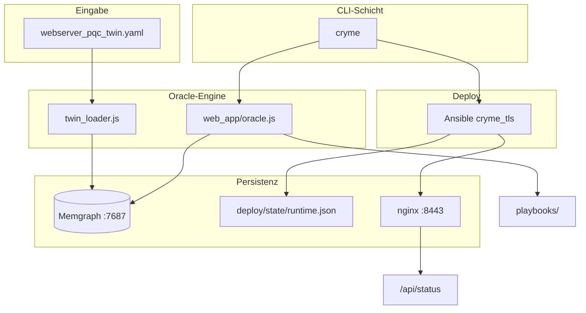

# CRYME — Technische Dokumentation

Diese Dokumentation erklärt den **Quellcode**, die **Architektur** und den **Datenfluss** von CRYME. Zielgruppe: Gutachter, die den Code nachvollziehen möchten, ohne jede Datei einzeln lesen zu müssen.

> Kurzüberblick für Anwender: [GUIDE.md](../GUIDE.md) · Installation: [INSTALL.md](../INSTALL.md)

---

## 1. Was CRYME technisch macht

CRYME ist ein **Orchestrator** für geplante PQC-Migrationen. Es ersetzt keine TLS-Implementierung, sondern verbindet vier Schichten:

```
webserver_pqc_twin.yaml          Digitaler Zwilling (Quelle der Wahrheit)
        ↓
web_app/oracle.js                Oracle-Engine (Validierung, SCC, Historie)
        ↓
cryme (CLI)                      Bedienoberfläche
        ↓
deploy/ (Docker + Ansible)       Live-HTTPS-Dienst auf Port 8443
```

**Kernidee:** Jede Migration wird zuerst im Graphen (Memgraph) validiert. Erst bei Erfolg entsteht ein Ansible-Playbook und kann per `cryme deploy` auf den Live-Dienst übertragen werden.

---

## 2. Projektstruktur (Code-Karte)

| Pfad | Sprache | Rolle |
|------|---------|-------|
| `cryme` | Node.js (CLI) | Einstiegspunkt — parst Argumente, ruft `oracle.js` und Shell-Skripte auf |
| `web_app/oracle.js` | JavaScript | **Kernlogik**: SCC, Migration, Replay, Playbook-Generierung |
| `web_app/twin_loader.js` | JavaScript | YAML → Memgraph laden (`cryme init`) |
| `webserver_pqc_twin.yaml` | YAML | Digitaler Zwilling (Webserver + Browser) |
| `deploy/docker-compose.yml` | YAML | Memgraph, nginx, curl-client |
| `deploy/roles/cryme_tls/` | Ansible/Jinja2 | TLS-Profil aus Migrationszustand ableiten |
| `deploy/verify_tls.sh` | Bash | TLS-Handshake + `/api/status` prüfen |
| `playbooks/` | Ansible YAML | Pro Migrationsschritt generierte Playbooks |
| `logs/` | Text | Oracle-Ausgabe pro Schritt |

---

## 3. Architekturdiagramm



---

## 4. Modul: `cryme` (CLI)

**Datei:** `cryme` (ausführbares Node.js-Skript)

### Aufgaben

1. Kommandozeilenargumente parsen (`show`, `migrate`, `deploy`, `verify`, `init`)
2. Memgraph-Session öffnen und Funktionen aus `oracle.js` aufrufen
3. Für `deploy` und `verify`: externe Tools starten (`ansible-playbook`, `bash deploy/verify_tls.sh`)

### Wichtige Befehle → Funktionen

| CLI-Befehl | Oracle-Funktion / externes Tool |
|------------|--------------------------------|
| `cryme init` | `initDatabase()` + `resetLiveServiceState()` |
| `cryme migrate …` | `migrateNodes()` |
| `cryme show state step=N` | `reconstructStateAtStep()` |
| `cryme show diff step=N` | `computeStepDiff()` |
| `cryme deploy step=N` | `getStepDeployInfo()` → Ansible |
| `cryme verify step=N` | `deploy/verify_tls.sh` |

### Verbindung zu Memgraph

```javascript
const URI = "bolt://localhost:7687";
const driver = neo4j.driver(URI, neo4j.auth.basic("", ""));
```

Kein Passwort — Memgraph läuft lokal im Docker-Container.

---

## 5. Modul: `web_app/oracle.js` (Oracle-Engine)

Das ist das **technische Herzstück** (~1300 Zeilen).

### 5.1 Graph-Algorithmen (rein in-memory)

| Funktion | Algorithmus | Zweck |
|----------|-------------|-------|
| `computeSCCs()` | Tarjan | Strongly Connected Components — welche Knoten müssen gemeinsam migriert werden? |
| `computeTransitiveReduction()` | Floyd-Warshall | Redundante Kanten entfernen (transitive Reduktion) |

### 5.2 Zustandsverwaltung

| Funktion | Beschreibung |
|----------|--------------|
| `loadStateFromDB()` | Liest aktuellen Graphen aus Memgraph (Knoten, Kanten, Historie) |
| `loadBaselineTopology()` | Statische Topologie aus YAML (ohne Laufzeit-Entdeckungen) |
| `reconstructStateAtStep(N)` | **Event Replay**: Zustand bei Schritt N durch Abspielen aller Events rekonstruieren |
| `getHeadStep()` | Aktueller HEAD-Zeiger (letzter erfolgreicher Schritt) |

**Event Sourcing:** Der Zustand bei Schritt N wird nicht gespeichert, sondern aus Baseline + MigrationSteps 1..N **berechnet**. Details: [GRAPH_VERSIONING.md](GRAPH_VERSIONING.md).

### 5.3 Migrationsablauf (`migrateNodes`)

```
1. Zielknoten auflösen (Name oder Memgraph-ID)
2. Cluster bilden (SCC über explizite + implizite + globale Kanten)
3. Pro Knoten Zielalgorithmus prüfen (PQCVariant aus YAML)
4. Oracle-Validierung (checkOracleValidation):
   - Bereits migriert? → redundant
   - Temporal constraints (not_before)?
   - Strukturelle Abhängigkeiten?
5. Bei Fehler: discovered_edge speichern (Oracle lernt neue Kante)
6. Bei Erfolg:
   - Knoten in Memgraph auf status=migrated setzen
   - MigrationStep-Event anlegen
   - HEAD aktualisieren
   - Ansible-Playbook generieren
   - Log schreiben
```

### 5.4 Oracle-Validierung (`checkOracleValidation`)

Prüft u.a.:

- **Co-Migration:** Knoten in derselben SCC müssen zusammen migriert werden
- **Implizite Abhängigkeiten:** SecurityControls hängen von CryptoAssets ab
- **Globale Abhängigkeiten:** Server-KEX ↔ Browser-KEX (Demo-Schritt 1 → Fail)
- **Temporal:** `not_before`-Constraints zwischen Komponenten

### 5.5 Deploy-Vorbereitung

| Funktion | Beschreibung |
|----------|--------------|
| `getStepDeployInfo(N)` | Liest Zustand bei Schritt N, erzeugt `deploy/vars/step_N.json` |
| `buildDeployVarsFromState()` | Mappt Knoten → Algorithmen für Ansible |
| `generatePlaybookContent()` | Schreibt Playbook mit `include_role: cryme_tls` |

---

## 6. Modul: `web_app/twin_loader.js`

Wird nur bei `cryme init` aufgerufen.

### Ablauf

1. Memgraph leeren (`MATCH (n) DETACH DELETE n`)
2. Für jede Komponente in YAML:
   - `Component`-Knoten anlegen
   - `CryptoAsset` + `PQCVariant`-Knoten anlegen
   - `SecurityControl`-Knoten anlegen
3. Kanten anlegen: `EXPLICIT_DEPENDENCY`, `IMPLICIT_DEPENDENCY`, `GLOBAL_DEPENDENCY`, `TEMPORAL_CONSTRAINT`
4. `SystemMeta { head_step: 0 }` und initialen `MigrationStep` (init) anlegen

**Quelle:** `webserver_pqc_twin.yaml`

---

## 7. Modul: Ansible-Rolle `cryme_tls`

**Pfad:** `deploy/roles/cryme_tls/`

### Eingabe (via `cryme deploy step=N`)

```json
{
  "migration_step": 2,
  "migrated_nodes": ["Webserver_Classic.KeyExchange_ECDHE", "Client_Browser.KeyExchange_ECDHE"],
  "target_algorithms": {
    "Webserver_Classic.KeyExchange_ECDHE": "X25519_MLKEM768",
    "Client_Browser.KeyExchange_ECDHE": "X25519_MLKEM768"
  }
}
```

### Ableitung des TLS-Profils (`tasks/main.yml`)

Aus `target_algorithms` werden abgeleitet:

| Bedingung | TLS-Profil | nginx-Zertifikat | Protokolle |
|-----------|------------|------------------|------------|
| Alles classic | `classic-rsa-ecdhe` | RSA-2048 | TLS 1.2 + 1.3 |
| Hybrid KEX | `hybrid-kex-classic-cert` | RSA-2048 | TLS 1.2 + 1.3 |
| ML-DSA Cert | `hybrid-kex-mldsa-cert` | ECDSA (Stand-in) | TLS 1.2 + 1.3 |
| Nur TLS 1.3 | `tls13-only` | je nach Cert | nur TLS 1.3 |

### Generierte Dateien

| Datei | Inhalt |
|-------|--------|
| `deploy/nginx/live/tls.conf` | nginx TLS-Konfiguration |
| `deploy/state/runtime.json` | API-Zustand für `/api/status` |
| `deploy/state/data.json` | API-Zustand für `/api/data` |
| `deploy/client/expect.env` | Erwartungen für curl-client (Browser-Simulation) |

nginx liest `runtime.json` statisch (Volume-Mount). Die API-Antwort kommt direkt aus dieser Datei — kein separater API-Container nötig.

---

## 8. Live-Dienst (Port 8443)

### Docker-Stack

| Container | Port | Funktion |
|-----------|------|----------|
| `cryme-memgraph` | 7687 | Graph-Datenbank |
| `cryme-memgraph-lab` | 3000 | Web-GUI |
| `cryme-nginx-classic` | 8443→443 | HTTPS + statische API-Dateien |
| `cryme-curl-client` | — | Simulierter Browser |

### API-Endpunkte

nginx serviert Dateien aus `deploy/state/`:

| URL | Datei | Inhalt |
|-----|-------|--------|
| `/api/status` | `runtime.json` | `migration_step`, `profile`, `algorithms` |
| `/api/data` | `data.json` | Beispiel-Payload |
| `/health` | inline | Health-Check + Header `X-Cryme-Tls-Profile` |

### Zwei Sichten auf denselben Zustand

```bash
cryme show state step=2        # Planungszustand (Memgraph-Replay)
curl -sk https://127.0.0.1:8443/api/status   # Laufzeitzustand (nginx)
```

Nach `cryme deploy step=2` müssen beide übereinstimmen.

---

## 9. Verifikation (`deploy/verify_tls.sh`)

Prüft unabhängig von CRYME:

1. **openssl s_client** — Zertifikat, Protokoll, Cipher
2. **curl vom Host** — `/health`
3. **curl aus curl-client-Container** — simuliert `Client_Browser`
4. **nginx-Header** — `X-Cryme-Tls-Profile`
5. **API-Status** — `curl -sk …/api/status`, vergleicht `migration_step` mit erwartetem Schritt

---

## 10. Datenmodell (Kurzform)

### Knotentypen in Memgraph

| Label | Beispiel-ID | Wichtige Properties |
|-------|-------------|---------------------|
| `Component` | `Webserver_Classic` | `phase` |
| `CryptoAsset` | `Webserver_Classic.KeyExchange_ECDHE` | `status`, `algorithm`, `active_algorithm` |
| `SecurityControl` | `Webserver_Classic.TLS_1.2_/_1.3_Communication` | `status`, `active_algorithm` |
| `PQCVariant` | `…mlkem768` | `algorithm`, `security_level` |
| `MigrationStep` | step=2 | `status`, `cluster`, `variants`, `head` |
| `SystemMeta` | `cryme` | `head_step` |

### Kantentypen

| Relation | Bedeutung |
|----------|-----------|
| `EXPLICIT_DEPENDENCY` | Deklarierte funktionale Abhängigkeit |
| `IMPLICIT_DEPENDENCY` | Implizite Abhängigkeit (inkl. zur Laufzeit entdeckte) |
| `GLOBAL_DEPENDENCY` | Komponentenübergreifend (Server ↔ Browser) |
| `TRANSITION_TO` | Migrationshistorie (Baum, nicht Abhängigkeitsgraph) |

Details: [DOMAIN_MODEL.md](DOMAIN_MODEL.md)

---

## 11. Typischer Demo-Ablauf (technisch)

```
cryme init
  → twin_loader.js lädt YAML in Memgraph
  → resetLiveServiceState() setzt runtime.json auf step=0

cryme migrate id=Webserver_Classic.KeyExchange_ECDHE X25519_MLKEM768
  → migrateNodes() findet GLOBAL_DEPENDENCY zu Client_Browser
  → Oracle: FAIL (Schritt 1), discovered_edge gespeichert

cryme migrate id=Webserver_Classic.KeyExchange_ECDHE X25519_MLKEM768  (nochmal)
  → SCC enthält jetzt beide KEX-Knoten
  → Oracle: SUCCESS (Schritt 2), Playbook generiert

cryme deploy step=2
  → getStepDeployInfo(2) → deploy/vars/step_2.json
  → ansible-playbook apply_tls.yml
  → nginx TLS-Profil + runtime.json aktualisiert

cryme verify step=2
  → verify_tls.sh prüft TLS + migration_step=2 in /api/status
```

---

## 12. Bekannte technische Limitierungen (Phase B)

| Bereich | Ist-Zustand | Geplant (Phase C) |
|---------|-------------|-------------------|
| PQC on-the-wire | ML-KEM/ML-DSA als **Namen**; OpenSSL nutzt klassisches TLS | OQS-nginx für echte PQC-Handshakes |
| Zertifikat ML-DSA | ECDSA als Stand-in | Echtes ML-DSA-Zertifikat |
| Szenarien | Webserver live, Automotive nur in YAML | Weitere Digital Twins |

---

## 13. Weiterführende Dokumentation

| Dokument | Inhalt |
|----------|--------|
| [MEMGRAPH_ANLEITUNG.md](MEMGRAPH_ANLEITUNG.md) | Memgraph bedienen, Beispielqueries |
| [GRAPH_VERSIONING.md](GRAPH_VERSIONING.md) | Event Sourcing, HEAD, Replay |
| [migration_explanation.md](migration_explanation.md) | Oracle SCC-Verhalten im Detail |
| [DOMAIN_MODEL.md](DOMAIN_MODEL.md) | ER-Diagramm, Namensregeln |
| [TLS_ALGORITHMS.md](TLS_ALGORITHMS.md) | TLS-Profile-Matrix |
| [KI_NUTZUNG.md](KI_NUTZUNG.md) | Dokumentation der KI-Nutzung |
